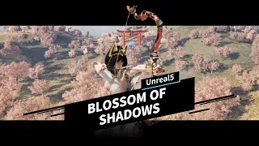

# **Blossom Of Shadow**
<table>
    <tr>
        <td align="center">
            <br>
            <em>Title</em>
        </td>
    </tr>
</table>

## 📌 Table of Contents

- [⚡ 30초 요약 (TL;DR)](#-30초-요약-tldr)
- [🎥 게임 플레이 영상](#-게임-플레이-영상)
- [📌 프로젝트 소개](#-프로젝트-소개)
- [🎮 게임 개발](#-게임-개발)
- [🎮 포트폴리오 링크](#-포트폴리오-링크)
- [🖼 In-Game Screenshot](#-in-game-screenshot)
- [🎮 Core System Implementation](#core-system-implementation)
  - [AI](#ai)
    - [↳ AI Controller](#-ai-controller)
    - [↳ BehaviorTree](#-behaviortree)
    - [↳ EQS](#-eqs)
  - [Weapon](#weapon)
    - [↳ Attachment](#-attachment)
    - [↳ Equipment](#-equipment)
    - [↳ BasicCombo](#-basic-combo)
    - [↳ Weapon Asset](#-weapon-asset)
  - [Skills](#skills)
    - [↳ Skill](#-skill)
    - [↳ Skill Aura, Aura](#-skill-aura-aura)
    - [↳ BackHole](#-backhole)
    - [↳ Skill AnimSpawn, Around](#-skill-animspawn-around)
    - [↳ Skill Bow Zooming, AnimData](#-skill-bow-zomming-animdata)
	- [↳ Skill Meteor, Meteor](#-skill-meteor-meteor)
	- [↳ Skill Ground Smash, Smash](#-skill-ground-smash-smash)
  	- [↳ Skill AirCombo](#-skill-aircombo)
   	- [↳ Skill Parry](#-skill-parry)  
  - [Component/Interface](#componentinterface)
    - [↳ MontageComponent](#-montagecomponent)
    - [↳ ZoomComponent](#-zoomcomponent)
    - [↳ TargetComponent](#-targetcomponent)
    - [↳ FeetComponent](#-feetcomponent)
    - [↳ 이외의 Component](#-이외의-component)
    - [↳ Character Interface](#-character-interface)
  - [Player Input](#plyaer-input)
    - [↳ Player Input](#-player-input)
  - [이벤트 & 시네마틱](#이벤트--시네마틱)
    - [↳ Portal](#-portal)
    - [↳ CinematicActor](#-cinematicactor)
  - [UI](#ui)
    - [↳ Title](#-title)
    - [↳ Pause, Player](#-pause-player)
    - [↳ Cross Hair](#-cross-hair)
    - [↳ HUD/Boss HP Bar](#-hudboss-hp-bar)
    - [↳ Weapon Quick Slot](#-weapon-quick-slot)
    - [↳ 게임 결과 창](#-게임-결과-창)
- [Troubleshooting](#troubleshooting)
- [Retrospective (느낀점)](#retrospective-느낀점)


# ⚡ 30초 요약 (TL;DR)

- **Blossom of Shadow**: Unreal Engine 5.4 기반 3D 액션/전투 중심 개인 프로젝트
- **핵심 구현**
  1) **AI 전투**: Behavior Tree + Blackboard 기반의 추적/공격/상태 전환 로직 구현  
  2) **전투 시스템**: 캐릭터 전투 흐름(공격/피격/사망 등)과 입력 처리 구조화  
  3) **프로젝트 구조화**: 시스템 단위로 코드를 분리하고, 기능별로 문서/링크로 정리
- **가장 어려웠던 점 → 해결**
  - AirCombo시 공중에 떠있지 못하는 문제 
    일정 거리 안에서 피격되면 공중으로 조금씩 띄우도록 보간
- **바로 보기**
  - 📌 시스템 설명/코드 링크: 아래 `Implementation` 섹션 참고

# 🎥 게임 플레이 영상
<p align="center">
  <a href="https://www.youtube.com/watch?v=sI_5kmsh7MY">
    
  </a>
</p>

# 📌 프로젝트 소개

“Blossom of Shadows”는 언리얼 엔진 기반으로 제작된 RPG 게임으로, 광활한 맵에서 외계에 적들을 물리치고 포탈을 넘어 외계 행성의 적을 쓰러트리는 이야기를 담고 있으며, 플레이어는 수많은 적들을 물리치고 살아남아 세상을 지켜내야 합니다.

# 🎮 게임 개발
>
> - **인원**: 1인  
> - **기간**: 24.01 ~ 24.10
> - **목적**: 언리얼 엔진과 C++을 공부한 것을 바탕으로 처음부터 끝까지 혼자서 게임을 개발하는 경험을 통해 엔진의 사용 방법을 익히기 위해 게임을 제작
> - **기술**: C++, Unreal Engine 5.4, Blueprint
</aside>

# 🎮 포트폴리오 링크
https://drive.google.com/file/d/1LRnWCWV3obmQORMKDY8yV8YeIxzddGuA/view?usp=sharing

# 🖼 In-Game Screenshot


# 🎮 **Core System Implementation**

## AI
### ✔ 설계 의도
- CCharacter 클래스를 상속받아 범용성 있고 쉬운 AI를 추가하고, AIController의 Team ID를 이용하여 Team 전투가 가능하도록 구현하려 함
- EQS를 활용하여 기본 공격만 하는 것이 아닌 다양한 패턴이 나올 수 있도록 함

### ✔ 구현 내용
#### ↳ [AI Controller](https://github.com/GyungSikHan/BlossomOfShadow/blob/main/Source/RPG/Characters/AI/CAIController.cpp#L66-L137)
- 감지 방법은 총 3가지로, Sight, Hearing, Damage로 구현
- Sight는 시야 범위 내에 캐릭터들이 들어오면 감지하도록 구현
- Hearing은 노이즈가 발생하면 그 위치를 감지하도록 구현	
- Damage는 Hearing과 비슷하게, AI에게 데미지를 준 위치를 감지하도록 구현
<table>
    <tr>
        <td align="center">
             <br>
            <em>AI Perception</em>
		</td>
</table>


```cpp
void ACAIController::OnPossess(APawn* InPawn)
{
Super::OnPossess(InPawn);
	   Enemy = Cast<ACEnemy_AI>(InPawn);
	   State = Cast<UCStateComponent>(Enemy->GetComponentByClass(UCStateComponent::StaticClass()));
	   MyTeam = Enemy->GetTeamID();
	   SetGenericTeamId(MyTeam);
	   if(Enemy->GetBehaviorTree() == nullptr)
		      return;
	   UBlackboardComponent* blackboard = Blackboard.Get();
	   UseBlackboard(Enemy->GetBehaviorTree()->BlackboardAsset, blackboard);

   Behavior = Cast<UCAIBehaviorComponent>(Enemy->GetComponentByClass(UCAIBehaviorComponent::StaticClass()));
	   Behavior->SetBlackboard(blackboard);

   RunBehaviorTree(Enemy->GetBehaviorTree());
}
void ACAIController::OnPerceptionUpdated(const TArray<AActor*>& UpdatedActors)
{
	   TArray < AActor* > actors;
	   Perception->GetCurrentlyPerceivedActors(nullptr, actors);
	   if(actors.Num() <= 0)
	   {
		      Blackboard->SetValueAsObject("Target", nullptr);
		      return;
	   }
	   for (AActor* actor : actors)
	   {
		      ACCharacter* character = Cast<ACCharacter>(actor);
		      float team = character->GetTeam();
		      if (team != MyTeam)
		      {
			         Behavior->SetTeamID(team);
			         Blackboard->SetValueAsObject("Target", actor);
			
			         return;
		      }
	   }
}
```
#### ↳ [BehaviorTree](https://github.com/GyungSikHan/BlossomOfShadow/tree/main/Source/RPG/BehaviorTree)
- AI는 각각의 Behavior Tree를 가지고 있으며, Behavior Tree에 설정된 대로 행동 함
- Behavior Tree는 블랙보드와 C++ 클래스로 만든 데코레이터, 서비스, 태스크를 통해 제어할 수 있도록 구현
- 태스크에서는 행동을 직접 수행하도록, 예를 들면 공격이나 추적 등을 처리하도록 구현
- 서비스에서는 상황에 따라 Controller, AIBehaviorComponent, 블랙보드의 값을 변경하여 행동에 변화를 주도록 구현
- 데코레이터는 조건에 맞는지 판단하여 태스크를 실행할지 여부를 결정하고, 그에 따라 행동을 수행

<table>
        <tr>
            <td align="center">
                <br>
                <em>Behavior Tree</em>
            </td>
	<td align="center">
                <br>
                <em>Behavior Tree</em>
            </td>
	</tr>
</table>

### ↳ [EQS](https://github.com/GyungSikHan/BlossomOfShadow/blob/main/Source/RPG/BehaviorTree/EQS_Context/CEQS_Context_AttackTarget.cpp)

- Target이 되는 캐릭터를 ContextData에 설정하여 EQS 쿼리의 중심으로 사용하는 클래스
- Testing Pawn을 사용하기 위해 if 문을 사용하여 Actor가 nullptr이 아닐 때 Player Start를 ContextData에 설정

- 근거리 EQS
	<table>
            <tr>
                <td align="center">
                    <br>
                    <em>근거리 EQS 설정</em>
                </td>
				<td align="center">
                    <br>
                    <em>근거리 Testing Pawn 확인</em>
                </td>
			</tr>
    </table>
	
	- Target(현재 Player)을 중심으로 원 모양의 5개의 포인트를 만들고 자신과의 거리에 따라 점수를 부여 후 가장 큰 점수에 도달할 수 있도록 구현
	- Target의 뒷편에는 점수를 부여하지 않아 계속 플레이어를 바라보도록 구현
	- 이를 통해 공격 후 뒷걸음질을 통해 거리를 벌림

- 원거리 EQS
	<table>
            <tr>
                <td align="center">
                    <br>
                    <em>원거리 EQS 설정</em>
                </td>
				<td align="center">
                    <br>
                    <em>원거리 Testing Pawn 확인</em>
                </td>
			</tr>
        </table>

	- Target(현재 Player)을 중심으로 그리디 모양으로 포인트를 만들어 가장 먼 거리에 높은 점수를 부여 후 가장 큰 점수에 도달할 수 있도록 구현
	- 현재 자신이 있는 근처는 이동하지 않게 하기위해 해당 영역은 점수를 측정하지 않도록 함
	- 이를 통해 Target이 접근하면 거리를 벌림

- 보스 Warp EQS
	<table>
            <tr>
                <td align="center">
                    <br>
                    <em>보스 Warp EQS 설정</em>
                </td>
				<td align="center">
                    <br>
                    <em>보스 Warp Testing Pawn 확인</em>
                </td>
			</tr>
        </table>

	- Target(현재 Player)을 중심으로 d원을 그려 가장 높은 점수를 가진 지점으로 Warp를 하도록 구현
	- 보스의 뒤편으로는 이동하지 않게 하기위해 해당 영역은 점수를 측정하지 않도록 함

- 보스 Warp EQS2
	<table>
            <tr>
                <td align="center">
                    <br>
                    <em>보스 Warp2 EQS 설정</em>
                </td>
				<td align="center">
                    <br>
                    <em>보스 Warp2 Testing Pawn 확인</em>
                </td>
			</tr>
        </table>

	- Target(현재 Player)을 중심으로 그리디 모양으로 포인트를 만들어 가장 가까운 거리에 높은 점수를 부여 후 가징 큰 점수에 도달할 수 있도록 구현
	- 이때, Target에 너무 가까운 거리는 이동하지 않도록, Target의 일정 거리보다 떨어진 지점부터 점수를 측정하도록 구현
```cpp
void UCEQS_Context_AttackTarget::ProvideContext(FEnvQueryInstance& QueryInstance,
                                                FEnvQueryContextData& ContextData) const
{
	   if(Actor != nullptr)
	   {
		      TArray<AActor*> playerStart;
		      UGameplayStatics::GetAllActorsOfClass(GetWorld(), 
        APlayerStart::StaticClass(), playerStart);
		      if(playerStart.Num() <= 0)
			         return;
		      APlayerStart* first = Cast<APlayerStart>(playerStart[0]);
		      UEnvQueryItemType_Actor::SetContextHelper(ContextData,first);
		      return;
	   }

	   ACEnemy_AI* ai = Cast<ACEnemy_AI>(QueryInstance.Owner.Get());
	   ACAIController* controller = ai->GetController<ACAIController>();
	   UBlackboardComponent* blackboard = controller
    ->GetBlackboardComponent();
	   AActor* target = Cast<AActor>(blackboard
    ->GetValueAsObject("Target"));

	   UEnvQueryItemType_Actor::SetContextHelper(ContextData, target);
}

```

## Weapon
### ✔ 설계 의도
- Attachment 클래스를 활용하여 범용성 있고 쉽게 무기를 만들도록 함
- Attachment안에 AttachTo 함수를 활용하여 C++ 클래스뿐만 아니라 Blueprint에서도 무기를 장착하기 쉽게 구현하도록 함
- Equip을 따로하는 클래스를 만들어 단일 책임 원칙을 지키려함

### ✔ 구현 내용

#### ↳ [Attachment](https://github.com/GyungSikHan/BlossomOfShadow/blob/main/Source/RPG/Weapon/CAttachment.cpp)
- 무기들은 이 클래스를 상속받아 생성되며, 생성된 자식 클래스들의 Mesh와 장착 방식만 변경하여 사용 가능
- 다양한 종류의 무기를 더 간단하게 만들 수 있도록 구현
<table>
            <tr>
                <td align="center">
                    <br>
                    <em>Weapon Bow</em>
                </td>
				<td align="center">
                    <br>
                    <em>Weapon Sword</em>
                </td>
				<td align="center">
                    <br>
                    <em>Weapon Magic Rod</em>
                </td>
					<td align="center">
                    <br>
                    <em>Weapon Hammer</em>
                </td>
        </table>
	<table>
            <tr>
                <td align="center">
                <br>
                <em>Weapon Blueprint</em>
            </td>
		</tr>
	</table>

```cpp
void ACAttachment::AttachTo(FName InSocketName)
{
    AttachToComponent(OwnerCharacter->GetMesh(), 
    FAttachmentTransformRules(EAttachmentRule::KeepRelative, true), InSocketName);
}

void ACAttachment::OnComponentBeginOverlap(UPrimitiveComponent* OverlappedComponent, AActor* OtherActor,
	UPrimitiveComponent* OtherComp, int32 OtherBodyIndex, bool bFromSweep, const FHitResult& SweepResult)
{
	   if (OwnerCharacter == OtherActor)
		      return;
	   if (OwnerCharacter->GetClass() == OtherActor->GetClass())
		      return;

	   if (OnAttachmentBeginOverlap.IsBound())
		       OnAttachmentBeginOverlap.Broadcast(OwnerCharacter, this, Cast<ACharacter>(OtherActor));
}
void ACAttachment::OnComponentEndOverlap(UPrimitiveComponent* OverlappedComponent, AActor* OtherActor,
	UPrimitiveComponent* OtherComp, int32 OtherBodyIndex)
{
	  if (OwnerCharacter == OtherActor)
		     return;
	  if (OwnerCharacter->GetClass() == OtherActor->GetClass())
		     return;

	   if (OnAttachmentEndOverlap.IsBound())
		     OnAttachmentEndOverlap.Broadcast(OwnerCharacter, Cast<ACharacter>(OtherActor));
}
void ACAttachment::OnCollisions()
{
	   if (OnAttachmentBeginCollision.IsBound())
		      OnAttachmentBeginCollision.Broadcast();

	   for (UShapeComponent* shape : Collisions)
		      shape->SetCollisionEnabled(ECollisionEnabled::QueryAndPhysics);
}
void ACAttachment::OffCollisions()
{
	   if (OnAttachmentEndCollision.IsBound())
		      OnAttachmentEndCollision.Broadcast();

   for (UShapeComponent* shape : Collisions)
		      shape->SetCollisionEnabled(ECollisionEnabled::NoCollision);
}
```

#### ↳ [Equipment](https://github.com/GyungSikHan/BlossomOfShadow/blob/main/Source/RPG/Weapon/CEquipment.cpp)
- 캐릭터에서 CWeaponComponent로 무기 장착 명령을 내리면, CEquipment 클래스의 함수들이 호출
- 이때, CEquipment 클래스 함수에 따라 각각의 델리게이트들을 전달하여, CWeaponAsset 클래스에서 ACAttachment 클래스에 알맞게 연결
- 각 무기들은 장착되기 전에 보일지 안 보일지를 블루프린트에서 설정할 수 있도록 하여, 일부 무기만 장착 전에도 보이게 구현
<table>
    <tr>
    	<td align="center">
    		<br>
        	<em>Weapon Equip Blueprint</em>
        </td>
		<td align="center">
    		<br>
             <em>Weapon Equip</em>
     	</td>
	</tr>
</table>

```cpp
void UCEquipment::Equip_Implementation()
{
	   State->SetEquipMode();

   if (OnEquipmentEquip.IsBound())
		      OnEquipmentEquip.Broadcast();

	   if (Data.bCanMove == false)
		      Movement->Stop();

	   if (Data.bUseControlRotation == true)
		  Movement->EnableControlRotation();

	   if(State->IsHittdMode() == true ||Data.Montage == nullptr)
	   {
		      Begin_Equip();
		      End_Equip();
	   }
	   else if(Data.Montage != nullptr)
		      OwnerCharacter->PlayAnimMontage(Data.Montage, Data.PlayRate);
}

void UCEquipment::Begin_Equip_Implementation()
{
	   bBeginEquip = true;
	   if (OnEquipmentBeginEquip.IsBound())
		      OnEquipmentBeginEquip.Broadcast();
}

void UCEquipment::End_Equip_Implementation()
{
	   bBeginEquip = false;
	   bEquipped = true;

	   Movement->Move();
	   State->SetIdleMode();
	   Weapon->SetEquip(false);
}

void UCEquipment::Unequip_Implementation()
{
	   bBeginEquip = false;
	   Movement->DisableControlRotation();

	   if (OnEquipmentUnequip.IsBound())
		      OnEquipmentUnequip.Broadcast();
}

void UCEquipment::HitEquip()
{
	   if(State->IsHittdMode() == false && Weapon->GetEquip() == false)
		      return;
	   Begin_Equip_Implementation();
	   End_Equip_Implementation();
}
```

#### ↳ [Basic Combo](https://github.com/GyungSikHan/BlossomOfShadow/blob/main/Source/RPG/Weapon/DoActions/CDoAction_Combo.cpp)
- CDoAction 클래스를 상속받은 CDoAction_Combo 클래스는 DoActionDatas에 저장된 애니메이션 몽타주를 실행하도록 구현
- 애니메이션에서 AnimNotify를 사용해 Begin()/End() 함수를 호출하고, AnimNotifyState로 콤보를 할 수 있도록 bExist를 변경할 수 있는 함수인 EnableCombo()/DisableCombo() 함수를 호출하여 여러 번의 공격을 통한 콤보를 구현
- 무기에 다른 캐릭터가 맞았을 때는 CAttachment 클래스에 만들어 놓은 델리게이트 함수를 사용하여 캐릭터에서 HitDatas의 정보를 넘겨줌
<table>
           <tr>
               <td align="center">
                   <br>
                   <em>Combo Attack</em>
               </td>
			</tr>
       </table>

```cpp
void UCDoAction_Combo::DoAction()
{
.....
   	Super::DoAction();
.....
	   DoActionDatas[Index].DoAction(OwnerCharacter);
}
void UCDoAction_Combo::Begin_DoAction()
{
	   Super::Begin_DoAction();
	   AAIController* controller = OwnerCharacter->GetController<AAIController>();
   	if (controller != nullptr)
	   {
		      float random = (float)UKismetMathLibrary::RandomFloatInRange(0, 1);
		      if (RandomIndex <= random)
			         bExsit = true;
   	}
.....
	   if(bExsit == false)
		      return;
	   bExsit = false;
   	Index++;
.....
	   DoActionDatas[Index].DoAction(OwnerCharacter);
}
void UCDoAction_Combo::End_DoAction()
{
	   Super::End_DoAction();

   Index = 0;
}
void UCDoAction_Combo::OnAttachmentBeginOverlap(ACharacter* InAttacker, AActor* InAttackCuaser, ACharacter* InOther)
{
	   Super::OnAttachmentBeginOverlap(InAttacker, InAttackCuaser, InOther);
	   if(InOther == nullptr)
		      return;
	   for (ACharacter* hitted : Hitted)
		      if(hitted == InOther)
			         return;
	   Hitted.AddUnique(InOther);
	   if(HitDatas.Num() -1 < Index)
		      return;
	   HitDatas[Index].SendDamage(InAttacker, InAttackCuaser, InOther);
}

void UCDoAction_Combo::OnAttachmentEndCollision()
{
	   Super::OnAttachmentEndCollision();
	   Hitted.Empty();
}
```
- [Bow](https://github.com/GyungSikHan/BlossomOfShadow/blob/main/Source/RPG/Weapon/DoActions/CDoAction_Bow.cpp)
	- CAttachment 클래스를 상속받아 만든 CAttachment_Bow 클래스는 다른 무기들과 달리 활 시위가 늘어나고 줄어드는 애니메이션을 넣기 위해 UPoseableMeshComponent를 사용
	- CAttachment_Bow 클래스에서 UPoseableMeshComponent 변수를 가져와, 특정 타이밍에 활 시위가 늘어나고 줄어들도록 Socket의 위치를 변경
	- 화살은 CreateArrow() 함수에서 SpawnActorDeferred를 사용해 월드에 화살을 보이기 전에 다른 캐릭터와 충돌이 생기지 않도록 설정하고, 그 후 UGameplayStatics::FinishSpawningActor() 함수를 사용하여 화살을 월드에 보이도록 구현

	<table>
            <tr>
                <td align="center">
                    <br>
                    <em>Start Bow Attack</em>
                </td>
                <td align="center">
                <br>
            <em>End Bow Attack</em>
                </td>
        </table>

```cpp
void UCDoAction_Bow::Begin_DoAction()
{
	   Super::Begin_DoAction();
	   bAttachedString = false;
	   *Bending = 0;
	   PoseableMesh->SetBoneLocationByName("bow_string_mid", OriginLocation, 
    EBoneSpaces::ComponentSpace);

.....
}

void UCDoAction_Bow::OnUnequip()
{
	   Super::OnUnequip();

   *Bending = 0;
	   OwnerCharacter->GetMesh()->SetCollisionEnabled(ECollisionEnabled::QueryOnly);

	   PoseableMesh->SetBoneLocationByName("bow_string_mid", OriginLocation, 
    EBoneSpaces::ComponentSpace);
.....
}

void UCDoAction_Bow::End_BowString()
{
	*Bending = 100;
	bAttachedString = true;
}
void UCDoAction_Bow::CreateArrow()
{
.....
	ACArrow* arrow = World->SpawnActorDeferred<ACArrow>(ArrowClass, transform, 
    NULL, NULL, ESpawnActorCollisionHandlingMethod::AlwaysSpawn);
	   if(arrow == nullptr)
		      return;
	
	   arrow->AddIgnoreActor(OwnerCharacter);
	
	   FAttachmentTransformRules rule = 
    FAttachmentTransformRules(EAttachmentRule::KeepRelative, true);
	   arrow->AttachToComponent(OwnerCharacter->GetMesh(), rule, 
    "Hand_Bow_Right_Arrow");
	
	   Arrows.Add(arrow);
	   UGameplayStatics::FinishSpawningActor(arrow, transform);
}
```

- [Warp](https://github.com/GyungSikHan/BlossomOfShadow/blob/main/Source/RPG/Weapon/DoActions/CDoAction_Warp.cpp)
	- CAttachment 클래스를 상속받아 만든 CAttachment_Warp는 장착 시 Decal을 보이도록 구현
	- Decal은 마우스가 이동하는 방향으로 계속해서 이동해야 하므로, Tick() 함수에서 GetCursorLocationAndRotation() 함수를 통해 PlayerController -> GetHitResultUnderCursorByChannel() 함수로 히트된 위치와 회전 값을 가져와 Decal의 위치와 회전을 계속해서 변경하면서 Decal이 이동하도록 구현
	- 액션 버튼을 누르면 Decal의 위치로 캐릭터를 이동하도록 구현
	- 이때 캐릭터가 땅에 묻히는 버그가 발생할 수 있는데, 이는 캐릭터의 캡슐 절반 크기를 가져와 위치를 올려주고, 회전 역시 UKismetMathLibrary::FindLookAtRotation() 함수를 사용하여 캐릭터가 바라보는 방향을 보정
	<table>
            <tr>
                <td align="center">
                    <br>
                    <em>Warp</em>
                </td>
        </table>

```cpp
void UCDoAction_Warp::Tick(float InDeltaTime)
{
.....
  	  Decal->SetWorldLocation(location);
	    Decal->SetWorldRotation(rotation);
}
void UCDoAction_Warp::DoAction()
{
	.....
	FRotator rotation;
	if (GetCursorLocationAndRotation(MoveToLocation, rotation))
	{
		float height = OwnerCharacter->GetCapsuleComponent()->GetScaledCapsuleHalfHeight();
		MoveToLocation = FVector(MoveToLocation.X, MoveToLocation.Y, MoveToLocation.Z + height);

		float yaw = UKismetMathLibrary::FindLookAtRotation(OwnerCharacter->GetActorLocation(), MoveToLocation).Yaw;
		OwnerCharacter->SetActorRotation(FRotator(0, yaw, 0));
	}
.....
	   DoActionDatas[0].DoAction(OwnerCharacter);
}

bool UCDoAction_Warp::GetCursorLocationAndRotation(FVector& OutLocation, FRotator& OutRotation)
{
    if(PlayerController == nullptr)
		      return false;

	   FHitResult hitResult;
	   PlayerController
    ->GetHitResultUnderCursorByChannel(ETraceTypeQuery::TraceTypeQuery1, false, 
    hitResult);
	   if (hitResult.bBlockingHit == false)
		      return 	false;

	   OutLocation = hitResult.Location;
	   OutRotation = hitResult.ImpactNormal.Rotation();

	   return true;
}
```

#### ↳ [Weapon Asset](https://github.com/GyungSikHan/BlossomOfShadow/blob/main/Source/RPG/Weapon/CWeaponAsset.cpp)
- CWeaponAsset 클래스는 UDataAsset 클래스를 상속받아 만든 클래스로, 이를 사용하여 에디터에서 무기에 대한 값을 쉽게 추가하거나 변경할 수 있도록 구현
- CAttachment, CEquipment, CDoAction, HitData, CSkills 클래스 등에 구현된 델리게이트를 연결하여 에디터 내에서 정보들을 변경할 때 적용될 수 있도록 구현
- 이렇게 WeaponAsset을 만들어 무기를 쉽고 빠르게 추가하고, 무기에 대한 정보도 빠르게 변경할 수 있어 범용성이 높은 클래스

<table>
    <tr>
        <td align="center">
            <br>
            <em>Data Asset</em>
        </td>
	    <td align="center">
            <br>
            <em>Data Asset</em>
        </td>
    </tr>
</table>
<table>   
	<td align="center">
    	<br>
        <em>Data Asset</em>
    </td>
</table>

```cpp
void UCWeaponAsset::BeginPlay(ACharacter* InOwner, UCWeaponData** OutWeaponData)
{
	   ACAttachment* attachment = nullptr;

   
     if (AttachmentClass != nullptr)
	   {
		      FActorSpawnParameters parames;
		      parames.Owner = InOwner;

		      attachment = InOwner->GetWorld()->SpawnActor<ACAttachment>(AttachmentClass, parames);
    }

	   UCEquipment* equipment = nullptr;
	   if(EquipmentClass != nullptr)
	   {
		      equipment = NewObject<UCEquipment>(this, EquipmentClass);
		      equipment->BeginPlay(InOwner, EquipmentData);
	
		      if(attachment != nullptr)
		      {
			         equipment->OnEquipmentBeginEquip.AddDynamic(attachment, &ACAttachment::OnBeginEquip);
			         equipment->OnEquipmentUnequip.AddDynamic(attachment, &ACAttachment::OnUnequip);
		      }
	   }

	   UCDoAction* doAction = nullptr;
	   if (DoActionClass != nullptr)
	   {
		      doAction = NewObject<UCDoAction>(this, DoActionClass);
		      doAction->BeginPlay(attachment, equipment, InOwner, DoActionDatas, HitDatas);

		      if (attachment != nullptr)
		      {
			         attachment->OnAttachmentBeginCollision.AddDynamic(doAction, 
            &UCDoAction::OnAttachmentBeginCollision);
			         attachment->OnAttachmentEndCollision.AddDynamic(doAction, 
            &UCDoAction::OnAttachmentEndCollision);

			         attachment->OnAttachmentBeginOverlap.AddDynamic(doAction, 
            &UCDoAction::OnAttachmentBeginOverlap);
			         attachment->OnAttachmentEndOverlap.AddDynamic(doAction, 
            &UCDoAction::OnAttachmentEndOverlap);
		      }
        if(equipment != nullptr)
		      {
			         equipment->OnEquipmentBeginEquip.AddDynamic(doAction, &UCDoAction::OnBeginEquip);
			         equipment->OnEquipmentUnequip.AddDynamic(doAction, &UCDoAction::OnUnequip);
		      }
	   }

	   TArray<UCSkills*> skills;
	   if(SkillsClass.Num() > 0)
	   {
		      for (int32 i = 0; i < SkillsClass.Num(); i++)
		      {
			         UCSkills* skill = NewObject<UCSkills>(this, SkillsClass[i]);
			         skills.Add(skill);
			         skills[i]->BeginPlay(InOwner, attachment, doAction);
		      }
	   }

	   *OutWeaponData = NewObject<UCWeaponData>();
	   (*OutWeaponData)->Attahcment = attachment;
	   (*OutWeaponData)->Equipment = equipment;
	   (*OutWeaponData)->DoAction = doAction;
	   for (int32 i = 0; i < SkillsClass.Num(); i++)
		      (*OutWeaponData)->Skills = skills;
}

#if WITH_EDITOR
void UCWeaponAsset::PostEditChangeChainProperty(FPropertyChangedChainEvent& PropertyChangedEvent)
{
	   Super::PostEditChangeChainProperty(PropertyChangedEvent);
	   if (FApp::IsGame() == true)
		      return;

	   bool bRefresh = false;
	   bRefresh |= PropertyChangedEvent.GetPropertyName().Compare("DoActionDatas") == 0;
	   bRefresh |= PropertyChangedEvent.GetPropertyName().Compare("HitDatas") == 0;

	   if (bRefresh == true)
	   {
		      bool bCheck = false;
		      bCheck |= PropertyChangedEvent.ChangeType == EPropertyChangeType::ArrayAdd;
		      bCheck |= PropertyChangedEvent.ChangeType == EPropertyChangeType::ArrayRemove;
		      bCheck |= PropertyChangedEvent.ChangeType == EPropertyChangeType::ArrayClear;
		      bCheck |= PropertyChangedEvent.ChangeType == EPropertyChangeType::Duplicate;

		      if(bCheck == true)
		      {
		    	     FPropertyEditorModule& prop =          
            FModuleManager::LoadModuleChecked<FPropertyEditorModule>("PropertyEditor");
			         TSharedPtr<IDetailsView> detailsView = 
            prop.FindDetailView("WeaponAssetEditorDetailsView");

			         if (detailsView.IsValid())
				            detailsView->ForceRefresh();
        }
	   }
}
#endif
```

## Skills
### ✔ 설계 의도
- Skill은 무기와 별개로 발동되는 클래스로 단일 책임 원칙을 지키려 노력함
- CSKill를 활용하여 범용성 있고 쉽게 스킬을 만들고 추가할 수 있도록 함

### ✔ 구현 내용

#### ↳ [Skill](https://github.com/GyungSikHan/BlossomOfShadow/blob/main/Source/RPG/Weapon/Skills/CSkills.h)
- CSkills 클래스는 플레이어가 스킬 버튼을 누르면 WeaponComponent에 의해 호출되는 클래스
- 모든 스킬은 CSkills 클래스를 상속받아 생성
- 스킬은 Skill_Pressed()와 Skill_Released() 함수를 두어, 버튼을 눌렀을 때와 버튼을 땠을 때 각각 기능을 구현
- Begin_Skill(), End_Skill(), Tick() 함수들은 UFUNCTION(BlueprintNativeEvent) 키워드를 사용하여 C++ 코드와 블루프린트에서 모두 사용 가능하게 하여 범용성을 높임

```cpp
UCLASS()
class RPG_API UCSkills : public UObject
{
   	GENERATED_BODY()
public:
   	bool GetInAction() { return bInAction; }
	   UPROPERTY(EditAnywhere, Category = "Action")
	   TArray<FDoActionData> ActionDatas;

public:
   	UCSkills();

public:
   	virtual void BeginPlay(class ACharacter* InOwner, class ACAttachment* InAttaachment, 
    class UCDoAction* InDoAction);

public:
   	virtual void Skill_Pressed();
	   virtual void Skill_Released();

public:
   	UFUNCTION(BlueprintNativeEvent)
	   void Begin_Skill();
	   virtual void Begin_Skill_Implementation() {}
	   UFUNCTION(BlueprintNativeEvent)
	   void End_Skill();
	   virtual void End_Skill_Implementation() {}
	   UFUNCTION(BlueprintNativeEvent)
	   void Tick(float InDeltaTime);
	   virtual void Tick_Implementation(float InDeltaTime) {}
...
};
```
#### ↳ [Skill Aura](https://github.com/GyungSikHan/BlossomOfShadow/blob/main/Source/RPG/Weapon/Skills/CSkills_Hammer01.cpp), [Aura](https://github.com/GyungSikHan/BlossomOfShadow/blob/main/Source/RPG/Weapon/Add_On/CAura.cpp)
- CSkills_Hammer01 클래스에서 CAura 액터를 Spawn시키도록 구현
- Timer와 Lambda 함수를 통해 일정 시간 동안 데미지가 지속적으로 캐릭터에게 들어가도록 구현하였고, 또 다른 Timer를 사용하여 일정 시간이 지나면 액터가 사라지는 함수가 호출되도록 구현

<table>
    <tr>
    	<td align="center">
    		<br>
        	<em>Aura</em>
        </td>
		<td align="center">
    		<br>
        	<em>Aura2</em>
        </td>
</table>

```cpp
void UCSkills_Hammer01::Begin_Skill_Implementation()
{
	   Super::Begin_Skill_Implementation();
	   FActorSpawnParameters params;
	   params.Owner = Cast<ACharacter>(Owner);
	   params.SpawnCollisionHandlingOverride = 
    ESpawnActorCollisionHandlingMethod::AlwaysSpawn;
	   FTransform transform;
	   transform.SetLocation(Owner->GetActorLocation());
	   transform.AddToTranslation(ActorLocation);
	   transform.SetRotation(FQuat(Owner->GetActorRotation()));
   	Owner->GetWorld()->SpawnActor<AActor>(ActorClass, transform, params);
}
```

```cpp
void ACAura::BeginPlay()
{
	   Super::BeginPlay();
.....
	   FTimerDelegate delegate = FTimerDelegate::CreateLambda([&]()
		  {
			     for (int32 i = Hitted.Num() - 1; i >= 0; i--)
				    HitData.SendDamage(Cast<ACharacter>(GetOwner()), this, Hitted[i]);
		  });
	   GetWorld()->GetTimerManager().SetTimer(TimerHandle, delegate, DamageInterval, 
    true, 0);
	   if(SpawnLife != 0)
		      GetWorldTimerManager().SetTimer(TimerHandle2, this, &ACAura::ActorDestroy, 
        SpawnLife);
}
void ACAura::OnNiagaraSystemFinished(UNiagaraComponent* PSystem)
{
	   GetWorld()->GetTimerManager().ClearTimer(TimerHandle);
   	GetWorld()->GetTimerManager().ClearTimer(TimerHandle2);
	   Destroy();
}
void ACAura::ReceiveParticleData_Implementation(const TArray<FBasicParticleData>& Data, UNiagaraSystem* NiagaraSystem,
	const FVector& SimulationPositionOffset)
{
	   INiagaraParticleCallbackHandler::ReceiveParticleData_Implementation(Data, 
    NiagaraSystem, SimulationPositionOffset);

   Box->SetRelativeScale3D(Data[0].Position);

   FVector location = Box->GetScaledBoxExtent();
	   location.Y = 0;
	   Box->SetRelativeLocation(location);
}
```
#### ↳ [BackHole](https://github.com/GyungSikHan/BlossomOfShadow/blob/main/Source/RPG/Weapon/Add_On/CBlackHole.cpp) 
- CSkills_Hammer01 클래스는 애니메이션 몽타주를 실행하면서 액터를 Spawn시키는 클래스이므로 Black Hole 스킬에도 사용
- Tick( )함수에서 UKismetSystemLibrary::SphereTraceMultiByProfile( )함수를 이용하여 구를 그린 뒤 그 구에 다른 캐릭터가 충돌하면 캐릭터를 AddActorWorldOffset( )함수를 이용하여 블랙홀의 중심으로 이동
- 이때 블랙홀에 UCapsuleComponent로 충돌체가 있고 그 충돌체에 충돌을 하면 Timer를 이용하여 계속해서 Damage를 입히도록 구현
- 다른 Timer를 통해 일정 시간이 지나면 액터가 사라지게 하였고 액터가 사라지기 전에 블렉홀이 터지는 나이아가라 이펙트를 실행하도록 구현

<table>
    <tr>
    	<td align="center">
    	<br>
        <em>Balck Hole</em>
        </td>
</table>

```cpp
void ACBlackHole::BeginPlay()
{
 	  Super::BeginPlay();

	   Niagara1->OnSystemFinished.AddDynamic(this, &ACBlackHole::OnSystemFinished);

	   DeadZone->OnComponentBeginOverlap.AddDynamic(this, &ACBlackHole::OnComponentBeginOverlap);
	   DeadZone->OnComponentEndOverlap.AddDynamic(this, &ACBlackHole::OnComponentEndOverlap);

	   GetWorldTimerManager().SetTimer(TimerHandle2, this ,&ACBlackHole::DestroyEffectPlay,SpawnLife);
}

void ACBlackHole::Tick(float DeltaTime)
{
	   Super::Tick(DeltaTime);
	   TArray<AActor*> ignore;
   	FVector start = GetActorLocation();
	   FVector end = start;
	   ignore.Add(GetOwner());
	   TArray<FHitResult> hitResults;
	   UKismetSystemLibrary::SphereTraceMultiByProfile(GetWorld(), start, end, Distance, "BlackHole", false, ignore, DrawDebug, hitResults, 
    true);
   	for (FHitResult hit : hitResults)
	   {
		      ACharacter* character = Cast<ACharacter>(hit.GetActor());
		      if (character != nullptr)
		      {
			         if (character->GetDistanceTo(this) <= Distance)
			         {
	
      			     FVector ends = character->GetActorLocation();
				            FVector direction = (start - ends).GetSafeNormal2D();
         				   character->AddActorWorldOffset(direction * Speed, true);
			         }
		      }
	   }
}

void ACBlackHole::OnSystemFinished(UNiagaraComponent* System)
{
	   GetWorld()->GetTimerManager().ClearTimer(TimerHandle);
	   for (ACharacter* hit : HitCharacters)
	   {
		      UCStatusComponent* status = Cast<UCStatusComponent>(hit->GetComponentByClass(UCStatusComponent::StaticClass()));
		      if (status->GetHealth() <= 0)
			         return;
		      HitDatas.PlayMontage(hit);
		      HitDatas.SendDamage(Cast<ACharacter>(Owner), this, hit);
	   }
   	Destroy();
}

void ACBlackHole::DestroyEffectPlay()
{
   	if (CollisionEffect == nullptr)
		      return;

	   UFXSystemComponent* com = Cast<UFXSystemComponent>(Niagara1);
	   UFXSystemComponent* com1 = Cast<UFXSystemComponent>(Niagara2);
   	UFXSystemComponent* com2 = Cast<UFXSystemComponent>(Niagara3);

	   if (com == nullptr)
		      return;
	   com->Deactivate();
	   if (com1 == nullptr)
		      return;
	   com1->Deactivate();
	   if (com2 == nullptr)
		      return;
	   com2->Deactivate();

	   FTransform transform = CollisionEffectTransform;
	   transform.AddToTranslation(this->GetActorLocation());

	   UNiagaraSystem* niagara = Cast<UNiagaraSystem>(CollisionEffect);
	   FVector location = transform.GetLocation();
	   FRotator rotator = FRotator(transform.GetRotation());
	   FVector scales = transform.GetScale3D();

	   UNiagaraFunctionLibrary::SpawnSystemAtLocation(GetWorld(), niagara, location, rotator, scales);
}

void ACBlackHole::Delegate()
{
	   for (int32 i = Hitted.Num() - 1; i >= 0; i--)
		     HitData.SendDamage(Cast<ACharacter>(GetOwner()), this, Hitted[i]);
}
```

#### ↳ [Skill AnimSpawn](https://github.com/GyungSikHan/BlossomOfShadow/blob/main/Source/RPG/Weapon/Skills/CSkills_AnimSpawn.cpp), [Around](https://github.com/GyungSikHan/BlossomOfShadow/blob/main/Source/RPG/Weapon/Add_On/CAround.cpp)
- CSkills_AnimSpawn 클래스에서 CAround 액터를 Spawn시키도록 구현
- Timer를 사용하여 SendDamage() 함수를 연결하고, 액터와 충돌할 때마다 데미지를 가하도록 구현
- CAround 액터는 플레이어를 기준으로 일정 거리 떨어져 원을 그리며 도는 스킬이므로, Tick() 함수에서 계속해서 위치를 계산하고 구한 위치로 변경하도록 구현
- 이때 액터의 위치가 변할 때마다 회전하여 자연스럽게 보이도록, Tick() 함수에서 Angle을 계속해서 계산하고 구한 Angle로 회전하도록 구현
- 액터가 랜덤한 위치에 생성되도록, UKismetMathLibrary::RandomFloatInRange() 함수를 사용해 범위 내에서 랜덤하게 위치를 설정하고, Tick() 함수에서 Angle 값에 Speed를 더하거나 빼서 플레이어 주위를 시계 방향과 시계 반대 방향으로 회전하도록 구현
- 마지막으로 Angle 값이 -360 또는 360일 경우, Angle에 Speed 값을 연산하면 원의 각도를 벗어날 수 있기 때문에, if문을 사용하여 -360 또는 360일 경우 Angle 값을 0으로 리셋하여 이를 구현

<table>
    <tr>
        <td align="center">
            <br>
            <em>Around</em>
        </td>
    </tr>
</table>

```cpp
void UCSkills_AnimSpawn::Begin_Skill_Implementation()
{
	   Super::Begin_Skill_Implementation();
	   int32 index = UKismetMathLibrary::RandomFloatInRange(0, ActorClass.Num() - 1);

	   FActorSpawnParameters params;
	   params.Owner = Cast<ACharacter>(Owner);
	   params.SpawnCollisionHandlingOverride = 
    ESpawnActorCollisionHandlingMethod::AlwaysSpawn;

	   Owner->GetWorld()->SpawnActor<AActor>(ActorClass[index], params);
}
```

```cpp
void ACAround::BeginPlay()
{
   	Super::BeginPlay();

   Angle = UKismetMathLibrary::RandomFloatInRange(0, 360);
	   Capsule->OnComponentBeginOverlap.AddDynamic(this, 
    &ACAround::OnComponentBeginOverlap);
	   Capsule->OnComponentEndOverlap.AddDynamic(this, 
    &ACAround::OnComponentEndOverlap);
	   GetWorld()->GetTimerManager().SetTimer(TimerHandle, this, &ACAround::SendDamage, 
    DamageInteval, true);
}
void ACAround::Tick(float DeltaTime)
{
	   Super::Tick(DeltaTime);
	   FVector location = GetOwner()->GetActorLocation();
	   Angle += (bNegative ? -Speed : +Speed) * DeltaTime;
	   if (FMath::IsNearlyEqual(Angle, bNegative ? -360 : +360))
		      Angle = 0;
	   FVector distance = FVector(Distance, 0, 0);
	   FVector value = distance.RotateAngleAxis(Angle, FVector::UpVector);
	   location += value;
	   SetActorLocation(location);
	   SetActorRotation(FRotator(0, Angle, 0));
}
```

#### ↳ [Skill Bow Zooming](https://github.com/GyungSikHan/BlossomOfShadow/blob/main/Source/RPG/Weapon/Skills/CSkills_Bow_Zomming.cpp), [AnimData](https://github.com/GyungSikHan/BlossomOfShadow/blob/main/Source/RPG/Weapon/Skills/CSkills_Bow_Zomming.h#L9-L26)
- CSkills_Bow_Zooming 스킬은 Skill_Pressed()가 호출되면 SpringArm에 저장된 Length, SocketOffset, CameraLag, Location 값을 변수에 백업하고, FAimData 구조체의 값으로 변경하여 카메라가 Zoom In되는 효과를 구현
- 이때 FTimeline과 UCurveVector를 사용하여 카메라의 이동이 부드럽게 진행되도록 구현
- FTimeline 변수에 OnAiming() 함수를 연결하여 Zoom In 시 화살 시위를 당기는 애니메이션을 실행하도록 구현
- Skill_Released()가 호출되면 백업된 변수 값으로 SpringArm의 값을 복원하여 원래의 카메라 위치로 이동하도록 하였고, 이때도 FTimeline과 UCurveVector를 사용하여 부드럽게 이동하도록 구현
- 또한, 이때 화살 시위를 당기지 않는 애니메이션을 실행하도록 구현

<table>
    <tr>
        <td align="center">
            <br>
            <em>기본</em>
        </td>
		<td align="center">
            <br>
            <em>Zoom In</em>
        </td>
    </tr>
</table>

```cpp
USTRUCT()
struct FAimData
{
	GENERATED_BODY()

public:
	UPROPERTY(EditAnywhere)
	float TargetArmLength = 100;

	UPROPERTY(EditAnywhere)
	FVector SocketOffset = FVector(0, 30, 10);

	UPROPERTY(EditAnywhere)
	bool bEnableCameraLag{};

	UPROPERTY(EditAnywhere)
	FVector CameraLocation = FVector::ZeroVector;
};
```

```cpp
void UCSkills_Bow_Zomming::Skill_Pressed()
{
.....
	OriginData.TargetArmLength = SpringArm->TargetArmLength;
	OriginData.SocketOffset = SpringArm->SocketOffset;
	OriginData.bEnableCameraLag = SpringArm->bEnableCameraLag;
	OriginData.CameraLocation = Camera->GetRelativeLocation();
	SpringArm->TargetArmLength = AimData.TargetArmLength;
	SpringArm->SocketOffset = AimData.SocketOffset;
	SpringArm->bEnableCameraLag = AimData.bEnableCameraLag;
	Camera->SetRelativeLocation(AimData.CameraLocation);
	Timeline.PlayFromStart();
}
void UCSkills_Bow_Zomming::Skill_Released()
{

.....
	SpringArm->TargetArmLength = OriginData.TargetArmLength;
	SpringArm->SocketOffset = OriginData.SocketOffset;
	SpringArm->bEnableCameraLag = OriginData.bEnableCameraLag;
	Camera->SetRelativeLocation(OriginData.CameraLocation);
	Timeline.ReverseFromEnd();
}
void UCSkills_Bow_Zomming::BeginPlay(ACharacter* InOwner, ACAttachment* InAttachment, UCDoAction* InDoAction)
{
	.....
	timeline.BindUFunction(this, "OnAiming");
	Timeline.AddInterpVector(Curve, timeline);
	Timeline.SetPlayRate(AimingSpeed);
	ACAttachment_Bow* bow = Cast<ACAttachment_Bow>(InAttachment);
	if (!!bow)
		Bend = bow->GetBend();
}
void UCSkills_Bow_Zomming::OnAiming(FVector Output)
{
	Camera->FieldOfView = Output.X;

	if (!!Bend)
		*Bend = Output.Y;
}
```

#### ↳ [Skill Meteor](https://github.com/GyungSikHan/BlossomOfShadow/blob/main/Source/RPG/Weapon/Skills/CSkills_Meteor.cpp), [Meteor](https://github.com/GyungSikHan/BlossomOfShadow/blob/main/Source/RPG/Weapon/Skills/CSkills_Defence.cpp)
- CSkills_Meteor 클래스에서 CMeteor 액터를 Spawn시키도록 구현
- CMeteor 액터는 나이아가라 이펙트에서 가져올 수 있는 Box 충돌체를 사용하여 충돌체의 크기를 계산
- ReceiveParticleData_Implementation() 함수에서 메테오 충돌체에 캐릭터가 충돌하면 데미지를 입히고, 메테오가 폭발하는 나이아가라 이펙트가 재생되도록 구현
- CMeteor 액터는 나이아가라 이펙트 편집 시 일정 범위 내에서 랜덤한 수의 Meteor 메시가 생성되도록 하였으며, 각각의 메시마다 고유한 충돌체를 가져 충돌 시 데미지를 입히도록 구현

<table>
    <tr>
        <td align="center">
            <br>
            <em>Meteor</em>
        </td>
    </tr>
</table>

```cpp
void UCSkills_Meteor::Begin_Skill_Implementation()
{
.....
   	if(ai != nullptr)
	   {
		     UCAIBehaviorComponent* behavior = Cast<UCAIBehaviorComponent>(ai
       ->GetComponentByClass(UCAIBehaviorComponent::StaticClass()));
		     ACharacter* target = behavior->GetTarget();
		     ownerLocation = FVector(target->GetActorLocation().X, target->GetActorLocation().Y, 
      Owner->GetActorRotation().RotateVector(MeteorLocation).Z);
	   }

   	transform.SetLocation(ownerLocation);
	   Owner->GetWorld()->SpawnActor<AActor>(MeteorClass, transform, params);

}
```
```cpp
void ACMeteor::BeginPlay()
{
	.....
	   if(NiagaraMesh != nullptr)
	   {
		      FBox box = NiagaraMesh->GetBoundingBox();
		      BoxExtent = (box.Min - box.Max).GetAbs() * 0.5;
	   }
}
void ACMeteor::ReceiveParticleData_Implementation(const TArray<FBasicParticleData>& Data, UNiagaraSystem* NiagaraSystem,
	const FVector& SimulationPositionOffset)
{
   	INiagaraParticleCallbackHandler::ReceiveParticleData_Implementation(Data, NiagaraSystem, SimulationPositionOffset);
	   if(Data.Num() <= 0)
		      return;
   	static TArray<AActor*> ignores;
	   ignores.AddUnique(GetOwner());

   static FHitResult hitResult;
	   for (int32 i = Data.Num() - 1; i >= 0; i--)
	   {
		      FVector position = Data[i].Position;
		      FVector scale = Data[i].Velocity * BoxExtent;
		      UKismetSystemLibrary::BoxTraceSingleByProfile(GetWorld(), position, position, scale, NiagaraMeshRotation, "Pawn", false, ignores, 
        DrawDebug, hitResult, true);
		      if(hitResult.bBlockingHit == true)
		      {
			         if(CollisionEffect != nullptr)
			         {
				            FTransform transform = CollisionEffectTransform;
				            transform.AddToTranslation(hitResult.Location);

	           				UNiagaraSystem* niagara = Cast<UNiagaraSystem>(CollisionEffect);
					           FVector location = transform.GetLocation();
					           FRotator rotator = FRotator(transform.GetRotation());
				           	FVector scales = transform.GetScale3D();

					          UNiagaraFunctionLibrary::SpawnSystemAtLocation(GetWorld(), niagara, location, rotator, scales);
            }
        }
			     ACharacter* character = Cast<ACharacter>(hitResult.GetActor());
			     if (character != nullptr)
				       HitData.SendDamage(Cast<ACharacter>(GetOwner()), this, character);
        }
	  }
}
```

#### ↳ [Skill Ground Smash](https://github.com/GyungSikHan/BlossomOfShadow/blob/main/Source/RPG/Weapon/Skills/CSkills_Hammer02.cpp), [Smash](https://github.com/GyungSikHan/BlossomOfShadow/blob/main/Source/RPG/Weapon/Add_On/CSmash.cpp)
- CSkills_Hammer02 클래스는 UCTargetComponent를 사용하여 타겟을 설정하고, 설정한 타겟과 스킬을 사용하는 캐릭터 사이의 거리를 계산한 후, AddActorWorldOffset() 함수를 사용하여 위치를 이동시켜 땅을 내리치는 스킬로 구현
- CSmash 액터는 AnimNotify를 사용하여 End_Skill() 함수가 호출될 때 Spawn되도록 구현
- CSmash 액터는 나이아가라 이펙트의 크기만큼 충돌체를 생성하여, 그 범위 내에 있는 캐릭터들이 모두 데미지를 입도록 구현
- 나이아가라 이펙트가 사라지면 이 액터도 Destroy()되도록 구현

<table>
    <tr>
        <td align="center">
            <br>
            <em>Ground Smash</em>
        </td>
    </tr>
</table>

```cpp
void UCSkills_Hammer02::Skill_Pressed()
{
.....
	   bMoving = true;
	   if(Target != nullptr && Target->GetTargetting() == false)
		      Target->Toggle_Target();
	.....
	   ActionDatas[Index].DoAction(Owner);
	   Start = Owner->GetActorLocation();
	   End = Start + Owner->GetActorForwardVector() * TraceDistance;
	   ACharacter* target;
	   if(Target != nullptr)
		      target = Target->GetTarget();
	   else
	   {
		      ACEnemy_AI* ai = Cast<ACEnemy_AI>(Owner);
		      UCAIBehaviorComponent* behavior = Cast<UCAIBehaviorComponent>(ai
        ->GetComponentByClass(UCAIBehaviorComponent::StaticClass()));
		      target = behavior->GetTarget();
	   }
	   if(target != nullptr)
		      End = target->GetActorLocation();
	   if (DrawDebug == EDrawDebugTrace::ForDuration)
		      DrawDebugDirectionalArrow(Owner->GetWorld(), Start, End, 25, FColor::Black, true, 5, 0, 0);
}

void UCSkills_Hammer02::Begin_Skill_Implementation()
{
	   Super::Begin_Skill_Implementation();
	   if (bMoving == false)
		      return;
	   FVector location = Owner->GetActorLocation();
	   float radius = Owner->GetCapsuleComponent()->GetScaledCapsuleHalfHeight();

   if (location.Equals(End, radius))
	   {
		      bMoving = false;
		      Start = End = Owner->GetActorLocation();
		      return;
	   }
   	FVector direction = (End - Start).GetSafeNormal2D();
	   Owner->AddActorWorldOffset(direction * Speed, true);
}
```
```cpp
void ACSmash::OnComponentBeginOverlap(UPrimitiveComponent* OverlappedComponent, AActor* OtherActor,
	UPrimitiveComponent* OtherComp, int32 OtherBodyIndex, bool bFromSweep, const FHitResult& SweepResult)
{
	   if (GetOwner() == OtherActor)
		      return;
	   ACharacter* character = Cast<ACharacter>(OtherActor);

   if (!!character)
		      Hitted.AddUnique(character);
}
void ACSmash::OnComponentEndOverlap(UPrimitiveComponent* OverlappedComponent, AActor* OtherActor,
	UPrimitiveComponent* OtherComp, int32 OtherBodyIndex)
{
	   if (GetOwner() == OtherActor)
		      return;

   ACharacter* character = Cast<ACharacter>(OtherActor);

   if (!!character)
		      Hitted.Remove(character);
}
```

#### ↳ [Skill AirCombo](https://github.com/GyungSikHan/BlossomOfShadow/blob/main/Source/RPG/Weapon/Skills/CSkills_AirCombo.cpp)
- CSkills_AirCombo 클래스는 CDoAction_Combo 클래스에서 콤보 공격을 구현한 방식과 유사하게 구현
- 스킬이 시작되면 기존 충돌체의 델리게이트 연결을 끊고, 새로운 충돌체를 생성하여 더 넓은 범위로 충돌이 발생하도록 구현
- 공중으로 띄우기 위해 LaunchCharacter() 함수를 사용하였고, AnimNotify를 이용해 애니메이션 몽타주마다 다른 방식으로 Launch를 적용
- 히트된 캐릭터 역시 LaunchCharacter() 함수를 사용하여 공중으로 띄웠고, 물리 가속으로 인해 충돌체를 벗어나는 문제를 방지하기 위해, 플레이어의 USceneComponent 위치를 가져와 캐릭터 위치를 보정하여 이를 방지

<table>
    <tr>
        <td align="center">
            <br>
            <em>AirCombo</em>
        </td>
    </tr>
</table>

```cpp
void UCSkills_AirCombo::Skill_Pressed()
{
.....
    if (bEnable == true)
	   {
		      bEnable = false;
		      bExsit = true;
		      return;
	   }
.....
	Attachment->OnAttachmentEndCollision.Remove(DoAction, "OnAttachmentEndCollision");
	Attachment->OnAttachmentBeginOverlap.Remove(DoAction, "OnAttachmentBeginOverlap");

	ActionDatas[Index].DoAction(Owner);
}
void UCSkills_AirCombo::Begin_Skill_Implementation()
{
.....
	   DrawCollision();

   	if (bExsit == false)
		      return;
.....
	bExsit = false;
	Index++;
	.....
	ActionDatas[Index].DoAction(Owner);
}
void UCSkills_AirCombo::End_Skill_Implementation()
{
	.....
	Attachment->OnAttachmentEndCollision.AddDynamic(DoAction, &UCDoAction::OnAttachmentEndCollision);
	Attachment->OnAttachmentBeginOverlap.AddDynamic(DoAction, &UCDoAction::OnAttachmentBeginOverlap);
.....
}
void UCSkills_AirCombo::DrawCollision()
{
	ACPlayer* player = Cast<ACPlayer>(Owner);
	if (player == nullptr)
		return;
	if(bDebug == true)
		DrawDebugSphere(Owner->GetWorld(), player->GetAirArrowComponent()->GetComponentLocation(), HitSphereRadius, 12, FColor::Red, false, LifeTime, 0, 0);
	TArray<FOverlapResult> result{};
	FCollisionQueryParams params;
	params.AddIgnoredActor(Owner);
	bool hitResult = Owner->GetWorld()->OverlapMultiByObjectType(result, player->GetAirArrowComponent()->GetComponentLocation(), FQuat::Identity, ECC_Pawn, FCollisionShape::MakeSphere(HitSphereRadius), params);
	if (hitResult == true)
		HitActor(result);
	
}
```

#### ↳ [Skill Parry](https://github.com/GyungSikHan/BlossomOfShadow/blob/main/Source/RPG/Weapon/Skills/CSkills_Defence.cpp)
- CSkills_Defence 클래스는 스킬이 시작되면 기존 충돌체의 델리게이트 연결을 끊고, CreateCollision() 함수에서 새로운 충돌체를 생성하도록 구현
- 생성된 충돌체는 OnComponentBeginOverlap을 UCSkills_Defence::OnComponentBeginOverlap() 함수와 연결하여, 충돌 시 새로운 애니메이션 몽타주가 실행
- 다른 캐릭터의 무기와 충돌체가 충돌하면 현재 실행 중인 애니메이션 몽타주의 남은 시간을 저장하고, 새로운 애니메이션 몽타주를 실행
- 그 후, 새로운 애니메이션 몽타주가 끝나면 원래 재생되던 애니메이션 몽타주의 남은 시간만큼 다시 실행되도록 구현
- Anim Notify State를 통해 특정 시간에 충돌이 발생하면, UGameplayStatics::SetGlobalTimeDilation() 함수를 사용하여 잠시 동안 월드의 시간이 느리게 흐르도록 구현

<table>
    <tr>
        <td align="center">
            <br>
            <em>Parry</em>
        </td>
	    <td align="center">
            <br>
            <em>Parry</em>
        </td>
    </tr>
</table>

```cpp
void UCSkills_Defence::Begin_Skill_Implementation()
{
	   Super::Begin_Skill_Implementation();
	   Attachment->OnAttachmentBeginOverlap.Remove(DoAction, "OnAttachmentBeginOverlap");
	   CrateCollision();
}
void UCSkills_Defence::ParryAttack()
{
	   UGameplayStatics::SetGlobalTimeDilation(Owner->GetWorld(), 0.2f);
}
void UCSkills_Defence::ResetTime()
{
	   UGameplayStatics::SetGlobalTimeDilation(Owner->GetWorld(), 1.0f);
	   bParry = false;
	   MontagePosition = 0.0f;
}
void UCSkills_Defence::SetParry(bool InIndex)
{
	   bParry = InIndex;
}
void UCSkills_Defence::OnComponentBeginOverlap(UPrimitiveComponent* OverlappedComponent, AActor* OtherActor,
UPrimitiveComponent* OtherComp, int32 OtherBodyIndex, bool bFromSweep, const FHitResult& SweepResult)
{
	   if (OtherActor == nullptr)
		      return;
	   if(OtherActor == Attachment)
		      return;
	   ACAttachment* otherCuasser = Cast<ACAttachment>(OtherActor);
	   if(otherCuasser == nullptr)
		      return;
	   if (bParry == true)
		      ParryAttack();
	   MontagePosition = Owner->GetMesh()->GetAnimInstance()
    ->Montage_GetPosition(ActionDatas[0].Montage);
	   Owner->PlayAnimMontage(Montage);
	   Hitted = otherCuasser->OwnerCharacter;
	   HitData.SendDamage(Owner, Attachment, otherCuasser->OwnerCharacter);
}
void UCSkills_Defence::CrateCollision()
{
	   if(Sphere != nullptr)
		      return;
	   Sphere = NewObject<USphereComponent>(Attachment);
	   Sphere->SetupAttachment(Attachment->GetRootComponent());
	   Sphere->InitSphereRadius(Radius);
	   if(bDebug == true)
	   {
		      Sphere->SetHiddenInGame(false);
		      Sphere->SetVisibility(true);
	   }
	   Sphere->SetCollisionProfileName(L"Defence");
	   Sphere->OnComponentBeginOverlap.AddDynamic(this, 
    &UCSkills_Defence::OnComponentBeginOverlap);
	   Sphere->RegisterComponent();
}

void UCSkills_Defence::DestroyCollision()
{
	   if(Sphere == nullptr)
		      return;
	   Hitted = nullptr;
	   Sphere->DestroyComponent();
	   Sphere = nullptr;
}
```

## Component/Interface

### ✔ 설계 의도
- 기능을 재사용하기 쉽고, 분리, 조합하여 Actor를 가볍고 유연하게 만들기 위해 사용

### ✔ 구현 내용

#### ↳ MontageComponent 

- [MontageData](https://github.com/GyungSikHan/BlossomOfShadow/blob/main/Source/RPG/Components/CMontagesComponent.h#L11-L22)
    - Montage Component에 있는 FMontagesData 구조체는 FTableRowBase를 상속받아 구현
    - 데이터 테이블 구현시 MontagesData라는 이름으로 검색하여, 구조체의 정보를 토대로 값을 가져올 수 있는 데이터 테이블을 구현
    - 구조체의 정보는 StateComponent에 만들어 놓은 Enum 타입의 정보 중 한 가지 타입으로 설정한 뒤, 캐릭터의 상태가 설정해 놓은 상태일 때 저장된 몽타주를 설정한 속도로 실행할 수 있는 정보를 가진 구조체
    
         <table>
            <tr>
                <td align="center">
                    <br>
                    <em>몽타주 데이터 테이블</em>
                </td>
        </table>

```cpp
USTRUCT()
struct FMontagesData : public FTableRowBase
{
	GENERATED_BODY()
public:
	UPROPERTY(EditAnywhere)
		EStateType Type = EStateType::Max;
	UPROPERTY(EditAnywhere)
		UAnimMontage* Montage{};
	UPROPERTY(EditAnywhere)
		float PlayRate = 1.0f;
};
```
- [MontageComponent](https://github.com/GyungSikHan/BlossomOfShadow/blob/main/Source/RPG/Components/CMontagesComponent.cpp#L54-L115)
    - 데이터 테이블을 통해 데이터를 더 편리하고 직관적으로 관리할 수 있게 구현
    - 캐릭터가 Component를 객체지향 5대 원칙 중 개방-폐쇄 원칙에 위배되지 않도록, 코드 수정 없이 기능을 변경할 수 있게 구현
        <table>
            <tr>
                <td align="center">
                    <br>
                    <em>몽타주 데이터 테이블</em>
                </td>
                <td align="center">
                    <br>
                    <em>데이터 테이블을 활용한 구르기 몽타주 재생</em>
                </td>
            </tr>
        </table>

        
```cpp
void UCMontagesComponent::PlayBackStepMode()
{
    PlayAnimMontage(EStateType::BackStep);
}

void UCMontagesComponent::PlayRollMode(int32 InIndex)
{
    if (InIndex == 0)
		      PlayAnimMontage(EStateType::Roll_B);
	   else if (InIndex == 1)
		     PlayAnimMontage(EStateType::Roll_F);
	   else if (InIndex == 2)
		     PlayAnimMontage(EStateType::Roll_L);
	   else if (InIndex == 3)
		     PlayAnimMontage(EStateType::Roll_R);
	   else if (InIndex == 4)
		     PlayAnimMontage(EStateType::Roll_FL);
	   else if (InIndex == 5)
		     PlayAnimMontage(EStateType::Roll_FR);
	   else if (InIndex == 6)
		     PlayAnimMontage(EStateType::Roll_BL);
	   else if (InIndex == 7)
		     PlayAnimMontage(EStateType::Roll_BR);
}
void UCMontagesComponent::PlayHitLandMode()
{
	   PlayAnimMontage(EStateType::HitLand);
}
void UCMontagesComponent::PlayKoandGetup()
{
	   PlayAnimMontage(EStateType::KoandGetup);
}
void UCMontagesComponent::PlayDeadMode()
{
	   PlayAnimMontage(EStateType::Dead);
}
void UCMontagesComponent::PlayAnimMontage(EStateType InType)
{
    if (OwnerCharacter == nullptr)
		      return;
	   FMontagesData* data = Datas[(int32)InType];
	   if (data == nullptr || data->Montage == nullptr)
    {
		      GLog->Log(ELogVerbosity::Error, "None montage data");
      		return;
	   }

   OwnerCharacter->PlayAnimMontage(data->Montage, data->PlayRate);
}
```

#### ↳ [ZoomComponent](https://github.com/GyungSikHan/BlossomOfShadow/blob/main/Source/RPG/Components/CZoomComponent.cpp)
- 마우스 휠을 입력시 TargetArmLength를 변화시켜 카메라가 이동하도록 구현
- FMath::Clamp() 함수를 사용하여 카메라 이동이 자연스럽게 이루어지도록 구현

<table>
        <tr>
            <td align="center">
                <br>
                <em>기본</em>
            </td>
            <td align="center">
                <br>
                <em>Zoom In</em>
            </td>
            <td align="center">
                <br>
                <em>Zoom Out</em>
            </td>
        </tr>
    </table>

```cpp

void UCZoomComponent::BeginPlay()
{
Super::BeginPlay();

   SpringArm = Cast<USpringArmComponent>(GetOwner()
    ->GetComponentByClass(USpringArmComponent::StaticClass()));
	   if(SpringArm == nullptr)
		      return;

   CurrentValue = SpringArm->TargetArmLength;
}

void UCZoomComponent::TickComponent(float DeltaTime, ELevelTick TickType, FActorComponentTickFunction* ThisTickFunction)
{
    Super::TickComponent(DeltaTime, TickType, ThisTickFunction);

	  if(SpringArm == nullptr)
		      return;

            if(UKismetMathLibrary::NearlyEqual_FloatFloat(SpringArm->TargetArmLength, CurrentValue) == true)
		      return;
	   SpringArm->TargetArmLength = 
    UKismetMathLibrary::FInterpTo(SpringArm->TargetArmLength, 
    CurrentValue, DeltaTime, InterpSpeed);
}

void UCZoomComponent::SetZoomValue(float InValue)
{
	   CurrentValue += (Speed * InValue);
	   CurrentValue = FMath::Clamp(CurrentValue, Range.X, Range.Y);
}
```

#### ↳ TargetComponent
- [TargetComponent](https://github.com/GyungSikHan/BlossomOfShadow/blob/main/Source/RPG/Components/CTargetComponent.cpp)
    - 키 입력 시 카메라 안에 들어오는 캐릭터들 중 일정 범위 내에서 하나의 캐릭터에 카메라를 고정하는 기능을 하는 컴포넌트
    - UKismetSystemLibrary::SphereTraceMultiByProfile() 함수를 사용하여 일정 범위 내에서 Hit된 캐릭터들을 가져옴
    - Hit된 캐릭터들을 이용해 UCBF_NearlyAngle::GetNearlyFrontAngle() 함수에서 하나를 선택해 리턴함
    - 반환된 캐릭터는 ChangeTarget() 함수에서 이펙트를 추가하고, Target 변수에 그 캐릭터를 저장
    - TickTarget() 함수에서 플레이어와 카메라가 좌우로 움직일 때 계속해서 Target 캐릭터로 돌아가도록 구현

    <table>
            <tr>
                <td align="center">
                <br>
                <em>Target</em>
            </td>
        </table> 
```cpp
void UCTargetComponent::BeginTarget()
{
    .....
	   TArray<FHitResult> hitResults;
	   UKismetSystemLibrary::SphereTraceMultiByProfile(GetWorld(), 
    start, end, TraceDistance, 
    "Targetting", false, actors, DrawDebug, hitResults, true);

	   for (FHitResult hit : hitResults)
		  if (hit.GetActor()->GetClass() != Character->GetClass())
			     targets.Add(Cast<ACharacter>(hit.GetActor()));

	   UCBF_NearlyAngle* helpers{};
	   ACharacter* target = helpers->GetNearlyFrontAngle(Character, 
    targets);
	   
    ChangeTarget(target);
}

void UCTargetComponent::ChangeTarget(ACharacter* InCandidate)
{
   	if(InCandidate == nullptr)
	   {
		      EndTarget();
		      return;
	   }

	   bTargetting = true;

	   if (Particle != nullptr)
		      Particle->DestroyComponent();

	   Particle = 
    UGameplayStatics::SpawnEmitterAttached(ParticleAsset, 
    InCandidate
    ->GetMesh(), "Root", ParticleLocation, FRotator(0, 0, 0), 
    ParticleScael);
	   Target = InCandidate;
}

void UCTargetComponent::TickTarget()
{
	   FRotator ControlRotation = Character->GetControlRotation();
	   FRotator find = 
    UKismetMathLibrary::FindLookAtRotation(Character
    ->GetActorLocation(), Target->GetActorLocation());
	   FRotator ownerToTarget = FRotator(ControlRotation.Pitch, 
    find.Yaw, find.Roll);

    if(UKismetMathLibrary::EqualEqual_RotatorRotator(ControlRotation, ownerToTarget, FinishAngle))
	   {
		      Character->GetController()
        ->SetControlRotation(ownerToTarget);
		      if (bMovingFocus == true)
			         bMovingFocus = false;
	   }
	   else
		      Character->GetController()
        ->SetControlRotation(UKismetMathLibrary::RInterpTo
        (ControlRotation,UKismetMathLibrary::MakeRotator
        (ownerToTarget.Roll, ownerToTarget.Pitch, 
        ownerToTarget.Yaw), GetWorld()->GetDeltaSeconds(), 
        InterpSpeed));
}
```
- [BF_NearlyAngle](https://github.com/GyungSikHan/BlossomOfShadow/blob/main/Source/RPG/Utilities/CBF_NearlyAngle.cpp)
    - UCBF_NearlyAngle::GetNearlyFrontAngle 함수를 통해 UCTargetComponent에서 전달된 캐릭터들과 플레이어 사이의 내적을 계산하여, 가장 가까운 캐릭터를 반환하도록 구현
```cpp
ACharacter* UCBF_NearlyAngle::GetNearlyFrontAngle(ACharacter* InCharacter, TArray<ACharacter*> InArray)
{
	   float angle{};
	   ACharacter* candidate{};

	   for (ACharacter* array : InArray)
	   {
		      FVector location = array->GetActorLocation() - InCharacter->GetActorLocation();
		      FVector forwardVector = UKismetMathLibrary::GetForwardVector(InCharacter
        ->GetControlRotation());
		      float dot = UKismetMathLibrary::Dot_VectorVector(location.GetSafeNormal2D(), 
        forwardVector);

		      if(dot >= angle)
		      {
			        angle = dot;
			        candidate = array;
		      }
	   }

	   return candidate;
}
```
#### ↳ FeetComponent
<table>
    <tr>
        <td align="center">
        <br>
        <em>IK 적용전</em>
    </td>
        <td align="center">
        <br>
        <em>IK 적용후</em>
    </td>
</table> 

- [FeetData](https://github.com/GyungSikHan/BlossomOfShadow/blob/main/Source/RPG/Components/CFeetComponent.h#L8-L28)
    - 캐릭터의 AnimInstance에서 IK를 위해 가져와야 할 값을 묶은 구조체
    <table>
        <tr>
            <td align="center">
            <br>
            <em>IK 설정 값</em>
        </td>
    </table> 

```cpp
USTRUCT(BlueprintType)
struct FFeetData
{
GENERATED_BODY()

public:
	   UPROPERTY(BlueprintReadOnly, EditAnywhere, Category = "Feet")
	  	FVector LeftDistance = FVector::ZeroVector; //X

	   UPROPERTY(BlueprintReadOnly, EditAnywhere, Category = "Feet")
	  	FVector RightDistance = FVector::ZeroVector; //X

   	UPROPERTY(BlueprintReadOnly, EditAnywhere, Category = "Feet")
  		FVector PelvisDistance = FVector::ZeroVector; //Z

	   UPROPERTY(BlueprintReadOnly, EditAnywhere, Category = "Feet")
		  FRotator LeftRotation = FRotator::ZeroRotator;

	   UPROPERTY(BlueprintReadOnly, EditAnywhere, Category = "Feet")
		  FRotator RightRotation = FRotator::ZeroRotator;
};
```

- [FeetComponent](https://github.com/GyungSikHan/BlossomOfShadow/blob/main/Source/RPG/Components/CFeetComponent.cpp#L24-82)
    - IK를 적용할 소켓을 가져와 Trace() 함수에서 소켓의 X, Y 값과 캐릭터의 위치 Z 값을 합쳐 새로운 벡터를 만들어 LineTrace가 시작할 벡터를 생성
    - 새로 구한 벡터의 Z 값에서 캡슐의 절반 높이와 TraceDistance 값을 각각 빼주어, 발보다 조금 더 아래까지 구한 값을 Z로 설정하고, 소켓의 X, Y 값과 합쳐 LineTrace가 끝날 벡터 생성
    - 두 벡터를 이용하여 UKismetSystemLibrary::LineTraceSingle() 함수로 Hit된 ImpactPoint와 TraceEnd의 차이를 OffsetDistance만큼 보정하고, TraceDistance만큼 빼주어 소켓이 올라가야 할 거리를 구함
    - Hit된 Normal 벡터의 Y, X 값을 가져와 Normal 벡터의 Z 값과 DeAtn2를 사용하여 회전할 각도를 각각 구한 후, roll과 pitch 값에 저장
    - roll에는 Y, Z 값을 이용해 구한 값, pitch에는 X, Z 값을 사용한 값에 -를 붙인 값을 넣어 회전 값을 구함
    - 그 이유는 Unreal 엔진에서 사용하는 좌표계와 애니메이션을 만들 때 사용하는 좌표계가 달라서 이렇게 설정해야 함
    - Trace에서 구한 값을 이용하여 TickComponent() 함수에서 왼발과 오른발 중 더 작은 값을 사용하여 PelvisDistance.Z와 LeftDistance.X/RightDistance.X, Left/RightRotation을 FInterpTo/RInterpTo 함수를 사용해 자연스럽게 변화 함

```cpp
void UCFeetComponent::TickComponent(float DeltaTime, ELevelTick TickType, FActorComponentTickFunction* ThisTickFunction)
{
	Super::TickComponent(DeltaTime, TickType, ThisTickFunction);

	float leftDistance, rightDistance;
	FRotator leftRotation, rightRotation;

	Trace(LeftSocket, leftDistance, leftRotation);
	Trace(RightSocket, rightDistance, rightRotation);

	float offset = FMath::Min(leftDistance, rightDistance);
	Data.PelvisDistance.Z = UKismetMathLibrary::FInterpTo(Data.PelvisDistance.Z, offset, DeltaTime, InterpSpeed);

	Data.LeftDistance.X = UKismetMathLibrary::FInterpTo(Data.LeftDistance.X, (leftDistance - offset), DeltaTime, InterpSpeed);
	Data.RightDistance.X = UKismetMathLibrary::FInterpTo(Data.RightDistance.X, -(rightDistance - offset), DeltaTime, InterpSpeed);

	Data.LeftRotation = UKismetMathLibrary::RInterpTo(Data.LeftRotation, leftRotation, DeltaTime, InterpSpeed);
	Data.RightRotation = UKismetMathLibrary::RInterpTo(Data.RightRotation, rightRotation, DeltaTime, InterpSpeed);
}

void UCFeetComponent::Trace(FName InName, float& OutDistance, FRotator& OutRotation)
{
 	  FVector soket = OwnerCharacter->GetMesh()->GetSocketLocation(InName);
   	float z = OwnerCharacter->GetActorLocation().Z;
	   FVector start = FVector(soket.X, soket.Y, z);
   	z = start.Z - OwnerCharacter->GetCapsuleComponent()->GetScaledCapsuleHalfHeight() - TraceDistance;
    FVector end = FVector(soket.X, soket.Y, z);

	   TArray<AActor*> ignores;
	   ignores.Add(OwnerCharacter);
	   FHitResult hitResult;
	   UKismetSystemLibrary::LineTraceSingle(GetWorld(), start, end, ETraceTypeQuery::TraceTypeQuery1, true, 
    ignores, DrawDebug, hitResult, true, FLinearColor::Green, FLinearColor::Red);
	   OutDistance = 0;
	   OutRotation = FRotator::ZeroRotator;
	   if(hitResult.bBlockingHit == false)
		      return;
	   float length = (hitResult.ImpactPoint - hitResult.TraceEnd).Size();
	   OutDistance = length + OffsetDistance - TraceDistance;
	   float roll = UKismetMathLibrary::DegAtan2(hitResult.Normal.Y, hitResult.Normal.Z);
	   float pitch = -UKismetMathLibrary::DegAtan2(hitResult.Normal.X, hitResult.Normal.Z);
	   OutRotation = FRotator(pitch, 0, roll);
}
```
- [AnimInstace](https://github.com/GyungSikHan/BlossomOfShadow/blob/main/Source/RPG/Characters/CAnimInstance.cpp#L35-L88)
    - CFeetComponent에서 구한 값을 FFeetData 변수에 저장한 후, CAnimInstance 클래스에서 이를 가져와 블루프린트에서 Transform Bone과 TwoBoneIK에 적용하여 자연스러운 애니메이션을 구현하기 위해 IK를 적용
    -조금 더 자연스러운 애니메이션을 위해 걷거나 뛰는 애니메이션마다 Left/Right Foot이라는 이름의 Curve를 만들어 Alpha 값으로 사용하고, 이동 시 어색한 애니메이션이 자연스럽게 변화하도록 구현
    <table>
        <tr>
            <td align="center">
            <br>
            <em>AinmInstace IK 적용</em>
        </td>
    </table> 

    
```cpp
void UCAnimInstance::NativeUpdateAnimation(float DeltaSeconds)
{
	   Super::NativeUpdateAnimation(DeltaSeconds);

	.....
	   
    UCFeetComponent* feet = Cast<UCFeetComponent>(OwnerCharacter
    ->GetComponentByClass(UCFeetComponent::StaticClass()));

	   bFeet = false;
	   if(feet != nullptr)
	   {
		      bFeet = true;
		      FeetData = feet->GetData();
	   }
}
```

#### ↳ 이외의 Component
- [StateComponent](https://github.com/GyungSikHan/BlossomOfShadow/blob/main/Source/RPG/Components/CStateComponent.cpp)
    - Idle, Hit, Equipment 등 행동을 관리하는 컴포넌트로 구현
- [StatusComponent](https://github.com/GyungSikHan/BlossomOfShadow/blob/main/Source/RPG/Components/CStatusComponent.cpp)
    - 캐릭터들의 체력, MP, Stamina를 관리하고 변화를 적용하는 컴포넌트로 구현
- [WeaponComponent](https://github.com/GyungSikHan/BlossomOfShadow/blob/main/Source/RPG/Components/CWeaponComponent.cpp)
    - 캐릭터가 무기 장착, 공격 및 스킬 사용시 무기에 직접 명령을 내리는 것이 아니라 이 컴포넌트를 통해 명령을 내리도록 구현

#### ↳ Character Interface  
- [ICharacter](https://github.com/GyungSikHan/BlossomOfShadow/blob/main/Source/RPG/Characters/Interface/ICharacter.h#L7-L22), [CAnimNotify_EndState](https://github.com/GyungSikHan/BlossomOfShadow/blob/main/Source/RPG/Notifys/CAnimNotify_EndState.cpp#L9-L47)
    - ICharacter는 플레이어, 몬스터, 보스 등에서 동일하게 사용할 수 있는 애니메이션 몽타주 함수를 인터페이스 화
    - ICharacter 인터페이스를 상속받아 구현된 CCharacter 클래스의 함수들은 애니메이션 몽타주가 끝날 때 이를 알리는 Notify 클래스를 만들어, Switch 문을 통해 현재 상태에 맞는 case에서 함수 호출
    - 인터페이스 함수들이 호출되면 EStateType을 Idle 상태로 되돌리는 등의 로직을 CCharacter에 구현하여, 다른 행동을 할 수 있도록 함
    
    
        <table>
            <tr>
                <td align="center">
                    <br>
                    <em>Back Step 몽타주 재생 후 상태 변경</em>
                </td>
                <td align="center">
                    <br>
                    <em>Dead 몽타주 재생 후 상태 변경</em>
                </td>
            </tr>
        </table>

```cpp
void UCAnimNotify_EndState::Notify(USkeletalMeshComponent* MeshComp, UAnimSequenceBase* Animation,
	const FAnimNotifyEventReference& EventReference)
{
....

	IICharacter* character = Cast<IICharacter>(MeshComp->GetOwner());

	if (character == nullptr)
		return;

	switch (StateType)
	{
	case EStateType::BackStep:
		character->End_BackStep();
		break;
	case EStateType::Roll_F:
	case EStateType::Roll_B:
	case EStateType::Roll_L:
	case EStateType::Roll_R:
	case EStateType::Roll_FR:
	case EStateType::Roll_FL:
	case EStateType::Roll_BR:
	case EStateType::Roll_BL:
		character->End_Roll();
		break;
	case EStateType::Hitted:
		character->End_Hitted();
		break;
	case EStateType::Dead:
		character->End_Dead();
		break;
	default:
		break;
	}
}
```

## Plyaer Input
### ✔ 설계 의도
- 기존의 Input 방식을 벗어나 새로운 Input 방식인 Enhanced Input을 사용하므로써 키 매핑, Trigger등 다양한 대응을 하기위해 이 방식을 사용

### ✔ 구현 내용

#### ↳ Player Input
- [Player 설정](https://github.com/GyungSikHan/BlossomOfShadow/blob/main/Source/RPG/Characters/CPlayer.h#L35-L76)
    - 플레이어의 입력은 언리얼 엔진 5에서 새롭게 추가된 EnhancedInput.InputMappingContext와 EnhancedInput.InputAction을 이용하여 구현
    - CPlayer에서 직렬화된 변수로 블루프린트에서 만든 EnhancedInput.InputAction을 연결해 주었고, EnhancedInput.InputMappingContext에서는 원하는 키 입력과 트리거 등에 의해 EnhancedInput.InputAction이 호출될 수 있도록 구현

    <table>
        <tr>
            <td align="center">
            <br>
            <em>IMC 매핑</em>
        </td>
    </table> 
```cpp
UCLASS()
class RPG_API ACPlayer : public ACCharacter
{
	GENERATED_BODY()
    //Move Input Action
	UPROPERTY(EditAnywhere, BlueprintReadOnly, Category = Input, meta = (AllowPrivateAccess = "true"))
		class UInputAction* MoveAction;
	UPROPERTY(EditAnywhere, BlueprintReadOnly, Category = Input, meta = (AllowPrivateAccess = "true"))
		UInputAction* Look;
	UPROPERTY(EditAnywhere, BlueprintReadOnly, Category = Input, meta = (AllowPrivateAccess = "true"))
		UInputAction* Sprint;
	UPROPERTY(EditAnywhere, BlueprintReadOnly, Category = Input, meta = (AllowPrivateAccess = "true"))
		UInputAction* Jumping;
	UPROPERTY(EditAnywhere, BlueprintReadOnly, Category = Input, meta = (AllowPrivateAccess = "true"))
		UInputAction* Avoid;
	UPROPERTY(EditAnywhere, BlueprintReadOnly, Category = Input, meta = (AllowPrivateAccess = "true"))
		UInputAction* Sword;
	UPROPERTY(EditAnywhere, BlueprintReadOnly, Category = Input, meta = (AllowPrivateAccess = "true"))
		UInputAction* Hammer;
	UPROPERTY(EditAnywhere, BlueprintReadOnly, Category = Input, meta = (AllowPrivateAccess = "true"))
		UInputAction* Rod;
	UPROPERTY(EditAnywhere, BlueprintReadOnly, Category = Input, meta = (AllowPrivateAccess = "true"))
		UInputAction* Bow;
	UPROPERTY(EditAnywhere, BlueprintReadOnly, Category = Input, meta = (AllowPrivateAccess = "true"))
		UInputAction* Warp;
	UPROPERTY(EditAnywhere, BlueprintReadOnly, Category = Input, meta = (AllowPrivateAccess = "true"))
		UInputAction* Action;
	UPROPERTY(EditAnywhere, BlueprintReadOnly, Category = Input, meta = (AllowPrivateAccess = "true"))
		UInputAction* Zooming;
	UPROPERTY(EditAnywhere, BlueprintReadOnly, Category = Input, meta = (AllowPrivateAccess = "true"))
		UInputAction* Targetting;
	UPROPERTY(EditAnywhere, BlueprintReadOnly, Category = Input, meta = (AllowPrivateAccess = "true"))
		UInputAction* ChangeTargetting;
	UPROPERTY(EditAnywhere, BlueprintReadOnly, Category = Input, meta = (AllowPrivateAccess = "true"))
		UInputAction* Skill1;
	UPROPERTY(EditAnywhere, BlueprintReadOnly, Category = Input, meta = (AllowPrivateAccess = "true"))
		UInputAction* Skill2;
	UPROPERTY(EditAnywhere, BlueprintReadOnly, Category = Input, meta = (AllowPrivateAccess = "true"))
		UInputAction* Menu;
	UPROPERTY(EditAnywhere, BlueprintReadOnly, Category = Input, meta = (AllowPrivateAccess = "true"))
	UInputAction* Pause;
	UPROPERTY(EditAnywhere, BlueprintReadOnly, Category = Input, meta = (AllowPrivateAccess = "true"))
	UInputAction* ControllUI;
protected:
	UPROPERTY(EditAnywhere, BlueprintReadOnly, Category = Input, Meta = (AllowPrivateAccess = "true"))
	TObjectPtr<class UInputMappingContext> DefaultMappingContext;
    ....
}
```

## 이벤트 & 시네마틱
### ✔ 설계 의도
- 기본 맵에서 Boss가 있는 맵으로 이동하기 위해 Portal이라는 기능을 만들어 재미 요소를 더함
- 맵이 이동하면서 생기는 딜레이를 시네마틱이라는 재미 요소를 집어 넣어 즐거움을 추가함

### ✔ 구현 내용

#### ↳ [Portal](https://github.com/GyungSikHan/BlossomOfShadow/blob/main/Source/RPG/Item/CPortal.cpp)
- CPotal 클래스는 플레이어가 충돌하면 시네마틱을 재생하고, 시네마틱이 끝난 후 보스가 있는 레벨로 이동하는 액터
- 플레이어가 충돌하면 ULevelSequencePlayer 클래스에 있는 델리게이트를 End() 함수와 연결하여 시네마틱이 끝나면 End() 함수가 실행되도록 하였고, 이때 DisableInput() 함수를 통해 모든 입력을 차단하여 시네마틱 중에 다른 입력이 되지 않도록 구현
- 또한 UGameplayStatics::GetAllActorsOfClass() 함수로 액터를 가져와 ACharacter 클래스와 ACAttachment 클래스를 보이지 않게 하고, Tick() 함수를 멈추도록 하여 시네마틱 재생에 방해되지 않도록 구현
- End() 함수에서는 UGameplayStatics::OpenLevel() 함수를 사용하여 보스가 있는 레벨로 이동하도록 구현하였고, 이때 플레이어의 체력을 저장하여 보스 레벨로 이동할 때 동일한 체력 상태를 유지할 수 있도록 구현
<table>
    	<tr>
        	<td align="center">
            	<br>
            	<em>Portal</em>
        	</td>
    	</tr>
	</table>

```cpp
void ACPortal::OnComponentBeginOverlap(UPrimitiveComponent* OverlappedComponent, AActor* OtherActor,
                                       UPrimitiveComponent* OtherComp, int32 OtherBodyIndex, bool bFromSweep, const FHitResult& SweepResult)
{
	   if (Cast<ACPlayer>(OtherActor) != Player)
		  return;
	
	   LevelSequencePlayer->OnFinished.AddDynamic(this, &ACPortal::End);
	   LevelSequencePlayer->Play();

	   Player->DisableInput(Controller);
	   SetActorEnableCollision(false);
	   TArray<AActor*> findActor;
	   UGameplayStatics::GetAllActorsOfClass(GetWorld(), AActor::StaticClass(), findActor);

	   for (AActor* actor : findActor)
	   {
		      UClass* actorClass = actor->GetClass();
		      if(UKismetMathLibrary::ClassIsChildOf(actorClass, ACharacter::StaticClass()) == true
			    || UKismetMathLibrary::ClassIsChildOf(actorClass, UUserWidget::StaticClass()) == true
			    || UKismetMathLibrary::ClassIsChildOf(actorClass, ACAttachment::StaticClass()) == 
       true)
		      {
			        actor->SetActorHiddenInGame(true);
			        actor->SetActorTickEnabled(false);
		      }
	   }
}

void ACPortal::End()
{
	   UGameplayStatics::OpenLevel(GetWorld(), "BossMap");
	   ACPlayer* player = Cast<ACPlayer>(Player);
	   if (player != nullptr)
		      player->SaveHP();
}
```

#### ↳ [CinematicActor](https://github.com/GyungSikHan/BlossomOfShadow/blob/main/Source/RPG/Item/CCinematicActor.cpp)
- CCinematic 클래스는 CPotal 클래스와는 달리 파티클이나 메쉬 없이 보이지 않는 충돌체만 있는 액터로 구현
- 플레이어가 이 충돌체에 충돌하면 CPotal의 OnComponentBeginOverlap() 함수와 동일하게 동작하도록 구현
- End() 함수에서는 입력을 차단했던 것을 풀기 위해 EnableInput() 함수를 사용하여 입력이 가능하도록 하였고, UGameplayStatics::GetAllActorsOfClass() 함수로 보이지 않게 했던 ACharacter 클래스와 ACAttachment 클래스를 모두 보이게 하고, Tick() 함수도 다시 실행
- 이렇게 구현하여 보스 방 입구에서 시네마틱이 재생되고, 시네마틱이 끝난 후에는 보스와 전투를 할 수 있게 구현
```cpp
void ACCinematicActor::OnComponentBeginOverlap(UPrimitiveComponent* OverlappedComponent, AActor* OtherActor,
	UPrimitiveComponent* OtherComp, int32 OtherBodyIndex, bool bFromSweep, const FHitResult& SweepResult)
{
	if(Cast<ACPlayer>(OtherActor) != Player)
		return;
	LevelSequencePlayer->OnFinished.AddDynamic(this, &ACCinematicActor::End);
	LevelSequencePlayer->Play();
	
	Player->DisableInput(Controller);
	SetActorEnableCollision(false);
	TArray<AActor*> findActor;
	UGameplayStatics::GetAllActorsOfClass(GetWorld(), AActor::StaticClass(), findActor);

	for (AActor* actor : findActor)
	{
		UClass* actorClass = actor->GetClass();
		if (UKismetMathLibrary::ClassIsChildOf(actorClass, ACharacter::StaticClass()) == true
			|| UKismetMathLibrary::ClassIsChildOf(actorClass, UUserWidget::StaticClass()) == true
			|| UKismetMathLibrary::ClassIsChildOf(actorClass, ACAttachment::StaticClass()) == true)
		{
			actor->SetActorHiddenInGame(true);
			actor->SetActorTickEnabled(false);
		}
	}
}

void ACCinematicActor::End()
{
	Player->EnableInput(Controller);
	SetActorEnableCollision(false);
	TArray<AActor*> findActor;
	UGameplayStatics::GetAllActorsOfClass(GetWorld(), AActor::StaticClass(), findActor);

	for (AActor* actor : DestroyActor)
	{
		actor->SetActorHiddenInGame(true);
		actor->SetActorEnableCollision(false);
	}

	for (AActor* actor : findActor)
	{
		UClass* actorClass = actor->GetClass();
		if (UKismetMathLibrary::ClassIsChildOf(actorClass, ACharacter::StaticClass()) == true
			|| UKismetMathLibrary::ClassIsChildOf(actorClass, UUserWidget::StaticClass()) == true
			|| UKismetMathLibrary::ClassIsChildOf(actorClass, ACAttachment::StaticClass()) == true)
		{
			actor->SetActorHiddenInGame(false);
			actor->SetActorTickEnabled(true);
		}
	}
	LevelSequencePlayer->Stop();
}
```

## UI
### ✔ 설계 의도
- 다양한 상황에 대처하고, 유저에게 즉각적이고 빠른 정보를 줄 수 있게 구현

### ✔ 구현 내용

#### ↳ [Title](https://github.com/GyungSikHan/BlossomOfShadow/blob/main/Source/RPG/Widget/CUserWidget_Title.cpp)
- 타이틀 레벨에서 시작 버튼을 누르면 엔진의 OpenLevel() 함수를 사용하여 게임 맵인 NewMap 레벨을 열어 게임이 시작되도록 구현
- 게임 종료 버튼을 누르면 엔진의 QuitGame() 함수를 사용하여 프로그램이 종료되도록 구현

<table>
    <tr>
        <td align="center">
            <br>
            <em>Title</em>
        </td>
    </tr>
</table>

```cpp
void UCUserWidget_Title::NativeConstruct()
{
    Super::NativeConstruct();

	   btnNewGame = 
    Cast<UButton>(GetWidgetFromName(TEXT("btnNewGame")));
	   if (btnNewGame != nullptr)
		      btnNewGame->OnClicked.AddDynamic(this, 
        &UCUserWidget_Title::OnStartGameClicked);

	    btnExit = Cast<UButton>(GetWidgetFromName(TEXT("btnExit")));
	    if (btnExit != nullptr)
		       btnExit->OnClicked.AddDynamic(this, 
         &UCUserWidget_Title::OnExitClicked);
}

void UCUserWidget_Title::OnStartGameClicked()
{
    UGameplayStatics::OpenLevel(GetWorld(), L"NewMap", true);
}

void UCUserWidget_Title::OnExitClicked()
{
    UKismetSystemLibrary::QuitGame(GetWorld(), GetOwningPlayer(), 
    EQuitPreference::Quit, false);
}
```

#### ↳ [Pause](https://github.com/GyungSikHan/BlossomOfShadow/blob/main/Source/RPG/Widget/CUserWidget_GameplayWidget.cpp), [Player](https://github.com/GyungSikHan/BlossomOfShadow/blob/main/Source/RPG/Characters/CPlayer.cpp#L470-L493)
- 게임 플레이 도중 M 버튼을 누르면 CPlayer 클래스에서 CUserWidget_GamePlayWidget UI를 화면에 띄우고, APlayerController에 구현된 SetPause() 함수를 이용하여 게임 전체 시간을 멈추었으며, 들어오는 입력을 UIInputMode로 바꿔 UI 창을 클릭할 수 있도록 구현
- UI에서 "게임으로 돌아가기" 창을 클릭하면 APlayerController를 통해 SetPause()를 풀어 시간이 다시 흐르도록 하고, 입력도 GameInputMode로 변경하였으며, 타이틀 화면을 클릭하면 엔진에 구현된 OpenLevel() 함수를 사용하여 타이틀 레벨로 돌아갈 수 있도록 구현

<table>
    <tr>
        <td align="center">
            <br>
            <em>Pause</em>
        </td>
    </tr>
</table>

```cpp
void UCUserWidget_GameplayWidget::NativeConstruct()
{
	   Super::NativeConstruct();

	   ResumeButton = 
    Cast<UButton>(GetWidgetFromName(TEXT("btnResume")));
	   if (ResumeButton != nullptr)
		      ResumeButton->OnClicked.AddDynamic(this, 
       &UCUserWidget_GameplayWidget::OnResumeClicked);

	   ReturnToTitleButton = 
    Cast<UButton>(GetWidgetFromName(TEXT("btnReturnToTitle")));
	   if (ReturnToTitleButton != nullptr)
		      ReturnToTitleButton->OnClicked.AddDynamic(this, 
        &UCUserWidget_GameplayWidget::OnReturnToTitleClicked);
}

void UCUserWidget_GameplayWidget::OnResumeClicked()
{
	   APlayerController* controller = 
    Cast<APlayerController>(GetOwningPlayer());
	   if (controller == nullptr)
		      return;
	   ACPlayer* player = Cast<ACPlayer>(controller->GetPawn());

	   RemoveFromParent();
	   player->ChangeInputMode(true);
	   controller->SetPause(false);
}

void UCUserWidget_GameplayWidget::OnReturnToTitleClicked()
{
	   UGameplayStatics::OpenLevel(GetWorld(), L"Title");
}
```

```cpp
void ACPlayer::OnGamePause()
{
	   MenuWidget =
Cast<UCUserWidget_GameplayWidget>(CreateWidget<UCUserWidget_GameplayWidget>(Owner->GetWorld(), 
    MenuWidgetClass));
	   if(MenuWidget == nullptr)
		      return;
	   MenuWidget->AddToViewport(3);

	   Controller->SetPause(true);
	   ChangeInputMode(false);
}

void ACPlayer::ChangeInputMode(bool bGameMode)
{
	   if (bGameMode == true)
	   {
		      Controller->SetInputMode(GameInputMode);
		      Controller->bShowMouseCursor = false;
	   }
	   else
	   {
		      Controller->SetInputMode(UIInputMode);
		      Controller->bShowMouseCursor = true;
	   }
}
```

#### ↳ [Cross Hair](https://github.com/GyungSikHan/BlossomOfShadow/blob/main/Source/RPG/Widget/CUserWidget_CrossHair.h)
- 플레이어가 활을 장착 중이라면 마우스 오른쪽 버튼을 눌러 조준할 수 있도록 구현
- 이때 화살이 날아갈 방향으로 하얀 색 조준선이 화면에 보이도록 구현
- CUserWidget_CrossHair 클래스에서 함수들은 UFUNCTION(BlueprintImplementableEvent) 키워드를 사용하여 블루프린트에서 구현하게 만들었으며, 기본 색을 쉽게 바꿀 수 있도록 구현

<table>
    <tr>
        <td align="center">
            <br>
            <em>Cross Hair 설정</em>
        </td>
    </tr>
</table>
<table>
    <tr>
        <td align="center">
            <br>
            <em>Cross Hair White</em>
        </td>
	    <td align="center">
            <br>
            <em>Cross Hair Red</em>
        </td>
    </tr>
</table>

#### ↳ [HUD/Boss HP Bar](https://github.com/GyungSikHan/BlossomOfShadow/blob/main/Source/RPG/Widget/CUserWidget_PlayerInterface.h)
- 플레이어와 보스 모두 CUserWidget_PlayerInterface 클래스를 사용하였으며, 함수들은 모두 UFUNCTION(BlueprintImplementableEvent) 키워드를 사용하여 블루프린트에서 구현
- 플레이어의 HUD(Head Up Display)는 캐릭터의 사진과 HP, MP, Stamina로 구성
- 또한 보스의 이름과 HP 역시 플레이어의 HUD에 표시되며, 플레이어가 만난 캐릭터가 보스일 때만 이름과 HP 바가 보이도록 구현
- HP, MP, Stamina는 플레이어와 보스의 Tick 함수에서 CGameInstance에 있는 함수를 통해 호출되어 값이 변할 때마다 프로그래스바가 갱신되도록 구현

<table>
    <tr>
        <td align="center">
            <br>
            <em>HP Bar</em>
        </td>
		<td align="center">
            <br>
            <em>HP Bar 설정</em>
        </td>
    </tr>
</table>

<table>
    <tr>
        <td align="center">
            <br>
            <em>Player HUD</em>
        </td>
		<td align="center">
            <br>
            <em>Boss HP Bar</em>
        </td>
    </tr>
</table>

```cpp
UCLASS()
class RPG_API UCUserWidget_PlayerInterface : public UUserWidget
{
    GENERATED_BODY()
public:
    UFUNCTION(BlueprintImplementableEvent, Category = "Label")
	   void UpdateName(const FString& InName);
	   
    UFUNCTION(BlueprintImplementableEvent, Category = "Label")
	   void UpdateControllerName(const FString& InName);
   
   	UFUNCTION(BlueprintImplementableEvent, Category = "Label")
	   void UpdateHealth(float InHealth, float InMaxHealth);
	  
   UFUNCTION(BlueprintImplementableEvent, Category = "Label")
	  void UpdateMP(float InMp, float InMaxMp);
	  
   UFUNCTION(BlueprintImplementableEvent, Category = "Label")
	  void UpdateStamina(float InStamina, float InMaxStamina);
	  
   UFUNCTION(BlueprintImplementableEvent, Category = "Label")
	  void UpdateSeeBoss(bool IsBoss, const FString& InName = "");
	  
   UFUNCTION(BlueprintImplementableEvent, Category = "Label")
	  void UpdateBossHealth(float InHealth, float InMaxHealth);
};
```

#### ↳ [Weapon Quick Slot](https://github.com/GyungSikHan/BlossomOfShadow/blob/main/Source/RPG/Widget/CUserWidget_Menu.cpp)
- 무기 창 UI를 띄운 후 버튼을 클릭하면 클릭한 버튼에 표시된 무기를 장착하도록 구현
- 블루프린트 위젯에서 설정한 버튼의 이름을 읽어와 "Action_"을 제거한 값을 int형으로 저장한 뒤, Switch 문을 사용하여 해당하는 Case를 가져와 이미지와 맞는 무기를 장착하게 구현

<table>
    <tr>
        <td align="center">
            <br>
            <em>Quick Slot</em>
        </td>
		<td align="center">
            <br>
            <em>Quck Slot</em>
        </td>
    </tr>
</table>

```cpp
void UCUserWidget_Menu::OnClicked(FString InName)
{
	for (UWidget* widget : Grid->GetAllChildren())
   {
	    if (widget->GetName() == InName)
	    {
		     ACPlayer* player = Cast<ACPlayer>(GetWorld()->GetFirstPlayerController()->GetCharacter());
		    player->MenuHide();
		    UCWeaponComponent* weapon = Cast<UCWeaponComponent>(player->GetComponentByClass(UCWeaponComponent::StaticClass()));
		    int32 result{};
		    FDefaultValueHelper::ParseInt(InName.Replace(L"Action_", L"", ESearchCase::IgnoreCase), result);
	        switch (result)
			{
		    case 0:
		            weapon->SetSwordMode();
		            break;
			case 1:
		            weapon->SetHammerMode();
		            break;
		    case 2:
		            weapon->SetMagicRodMode();
		            break;
		    case 3:
		            weapon->SetBowMode();
		            break;
		    case 4:
		            weapon->SetWarpMode();
		            break;
		    default:
			        break;
			}
    	}
	}
}
```

#### ↳ 게임 결과 창
- [Player Dead Widget](https://github.com/GyungSikHan/BlossomOfShadow/blob/main/Source/RPG/Widget/CUserWidget_Result.cpp), [GameInstance](https://github.com/GyungSikHan/BlossomOfShadow/blob/main/Source/RPG/Init/CGameInstance.cpp#L75-L88)
	- 플레이어가 죽으면 End_Dead() 함수가 호출되며, 이때 CGameInstance 클래스에 있는 ShowResultUI() 함수를 호출하여 CUserWidget_Result 클래스의 GameResult() 함수를 호출하여 게임 결과 창을 띄우게 구현
	- 이때, 보스와 플레이어의 결과가 다르게 표시되도록 하기 위해 bool형 변수를 사용하여 결과가 다르게 나타나도록 구현
	<table>
    	<tr>
        	<td align="center">
            	<br>
            	<em>Player Dead</em>
        	</td>
    	</tr>
	</table>

```cpp
.....
void UCUserWidget_Result::GameResult(bool InAmount)
{
	if (InAmount == true)
		Result->SetText(FText::FromString(L"Player Dead"));
	else
		Result->SetText(FText::FromString(L"Boss Dead"));
}
```
```cpp
void UCGameInstance::ShowResultUI(UWorld* InWorld, bool bPlayer)
{
	APlayerController* controller = UGameplayStatics::GetPlayerController(InWorld, 0);
	if (controller == nullptr)
		return;

	ResultWidget = Cast<UCUserWidget_Result>(CreateWidget(InWorld, ResultWidgetClass));
	ResultWidget->AddToViewport();
	ResultWidget->GameResult(bPlayer);
	FInputModeUIOnly UIInputMode;
	controller->SetPause(true);
	controller->SetInputMode(UIInputMode);
	controller->bShowMouseCursor = true;
}
```

- [Boss Dead](https://github.com/GyungSikHan/BlossomOfShadow/blob/main/Source/RPG/Characters/AI/CEnemy_AI.cpp#L117-L133), [Drap Item](https://github.com/GyungSikHan/BlossomOfShadow/blob/main/Source/RPG/Item/CDrop_Item.cpp)
	- 보스가 죽었을 때는 플레이어와 다르게 바로 결과 창이 뜨지 않도록 구현
	- CDrop_Item 클래스를 사용하여 보스가 죽은 위치에 아이템 액터를 생성하게 하였으며, 이 액터에 충돌 시 결과 창이 뜨도록 구현

<table>
    <tr>
        <td align="center">
            <br>
            <em>Drop Item</em>
        </td>
		<td align="center">
            <br>
            <em>Boss Dead Result</em>
        </td>
    </tr>
</table>

```cpp
void ACEnemy_AI::Drop_Item()
{
	   FVector start = GetActorLocation();
	   FVector end = start - FVector(0,0,200);
	   FHitResult result;
	   TArray<AActor*> ignore;
	   ignore.AddUnique(this);

	   bool bHit = UKismetSystemLibrary::LineTraceSingle(GetWorld(), start, end, 
    ETraceTypeQuery::TraceTypeQuery1, false, ignore, DropItemDebug, result, 
    true);

	   FActorSpawnParameters param{};
	   param.Owner = this;
	   param.SpawnCollisionHandlingOverride = 
    ESpawnActorCollisionHandlingMethod::AdjustIfPossibleButAlwaysSpawn;

	   FTransform transform = 
    UKismetMathLibrary::MakeTransform(result.Location, 
    UKismetMathLibrary::MakeRotator(0.0f, 0.0f, 
    UKismetMathLibrary::RandomFloatInRange(0.0f, 360.0f)));
	   AActor* ac = GetWorld()->SpawnActor<ACDrop_Item>(DropItem, 
    transform,param);
}
```
```cpp
void ACDrop_Item::OnComponentBeginOverlap(UPrimitiveComponent* OverlappedComponent, AActor* OtherActor,
	UPrimitiveComponent* OtherComp, int32 OtherBodyIndex, bool bFromSweep, const FHitResult& SweepResult)
{
	   UCGameInstance* gameInstance = 
    Cast<UCGameInstance>(UGameplayStatics::GetGameInstance(GetOwner()
    ->GetWorld()));
	   gameInstance->ShowResultUI(GetOwner()->GetWorld(), false);
}
```

# **Troubleshooting**

### 1) 🎯 CAura 액터는 이펙트가 늘어나기 때문에 충돌체도 함께 늘어나야 했는데, 이 과정에서 문제가 발생
- 예를 들어 X축으로 늘린다고 했을 때, 충돌체는 중심을 기준으로 X축의 +,- 방향으로 늘어나기 때문에, 중심을 기준으로 플레이어 쪽으로 늘어난 부분을 잘라 반대편 방향으로 더 늘어나게 해야 함
- 엔진 내에 ReceiveParticleData_Implementation() 함수를 사용하여 이 문제를 해결


### 2) 🎯 AirCombo시 AI가 피격이 안되는 문제 발생
- 칼에 부착된 충돌체가 너무 작아 공중에서 충돌이 안되는 결과 발생
- 이를 해결하기 위해 Air Combo시 기존 칼에 부착된 충돌체를 끄고 적절한 크기의 새로운 충돌체 생성 후 Overlap 시켜 AirCombo가 계속 발생하도록 문제를 해결

### 3) 🎯 AirCombo시 Player, 피격된 적이 공중에 떠있지 못하는 문제 발생
- LaunchCharacter()함수를 이용해 공중에 뜬 뒤 공중에 멈추도록 좌표를 고정했지만 동작이 어색하게 구현이 됨
- 이를 해결하기 위해 좌표를 멈추는게 아닌 Player는 Air Combo를 할때마다 LaunchCharacter 함수를 호출하여 공중에 계속 뜰 수 있도록 보간을 함
- 피격된 적도 피격됐다면 LaunchCharacter 함수를 호출하여 공중에 계속 뜰 수 있도록 보간을 함
- 이처럼 보간을 이용하여 문제를 해결

### 4) 🎯 AirCombo시 피격된 적이 멀리 날아가는 문제 발생
- 피격된 적이 공중에서 또 다시 피격이 되면 멀리 날아가는 문제 발생
- 이를 해결하기 위해 Player에서 ArrowComponent를 추가하여 Air Combo 발생 시 충돌체와 Arrow에 충돌했다면 공중으로 띄우는것 뿐만 아니라 Player와 일정 거리만큼 가까워지도록 보간을 하여 문제를 결

### 5) 🎯 AI Team ID 설정시 인식하지 못하는 문제 발생
- 각 캐릭터마다 Team ID를 설정하였지만 Controller에 전달하지 못하는 문제 발생
- Controller에서 Pawn의 Team을 알이귀해 OnPossess() 함수에서 SetGenericTeamId에 GetTeamID()를 이용해 Team ID 설정
- CCharacter 클래스에서 자신의 Team 번호를 넘겨주는 함수 GetTeam()을 만들어 다른곳에서 사용 가능하도록 함
- 이후 OnPerceptionUpdated 함수에서 인식한 Actor를 CCharacter로 케스팅 후 GetTeam() 함수를 호출하여 Team을 확인
- 주인 Pawn의 Team ID와 인식한 Actor의 Team ID를 비교해 중립 Team이 아니거나 같지 않다면 Blackboard의 Target으로 해당 Actor를 넘김
- 이를 통해 AI가 Team을 인식하고 Team이 아니라면 공격을 하거나 추격을 하도록 구현이됨


# **Retrospective (느낀점)**
- Blossom Of Shadow를 제작하면서 게임 로직의 흐름에 대해 이해하는 계기가 되었음
- 엔진 내부 코드와 공식 문서를 읽고 문제를 해결하면서 엔진에 대한 이해도가 높아졌음
- 어렵고 잘 해결되지 않는 문제들을 해결하면서 문제 해결 능력을 길렀음
- 이러한 과정들을 통해 단순히 엔진을 사용하는 방법뿐만 아니라 그래픽스 파이프라인, CS 등을 더욱 열심히 공부해야 내가 원하는 게임을 만들 수 있따는 것을 알게되어 힘들었지만 정말 재미있었음
